# MySQL

## 1.基本概念

1.什么是数据库？什么是数据库管理系统？什么是SQL？他们之间的关系是什么？

- **数据库**：英文单词DataBase，简称DB。按照一定格式存储数据的一些文件的组合。顾名思义：存储数据的仓库，实际上就是一堆文件。这些文件中存储了具有特定格式的数据。

- **数据库管理系统**：DataBaseManagement，简称DBMS。数据库管理系统是专门用来管理数据库中数据的，数据库管理系统可以对数据库当中的数据进行增删改查。

  常见的数据库管理系统：MySQL、Oracle、MS SqlServer、DB2、sybase等....

- **SQL：结构化查询语言**：程序员需要学习SQL语句，程序员通过编写SQL语句，然后DBMS负责执行SQL语句，最终来完成数据库中数据的增删改查操作。SQL是一套标准，程序员主要学习的就是SQL语句，这个SQL在mysql中可以使用，同时在Oracle中也可以使用，在DB2中也可以使用。

2.三者之间的关系？
DBMS--执行--> SQL --操作--> DB

先安装数据库管理系统MySQL，然后学习SQL语句怎么写，编写SQL语句之后，DBMS对SQL语句进行执行，最终来完成数据库的数据管理。


## 4.看一下计算机上的服务，找一找MySQL的服务在哪里？

计算机-->右键-->管理-->服务和应用程序-->服务-->找mysql服务。MySQL的服务，默认是“启动”的状态，只有	启动了mysql才能用。默认情况下是“自动”启动，自动启动表示下一次重启操作系统的时候，自动启动该服	务。

可以在服务上点击右键：
	启动
	重启服务
	停止服务
	...

还可以改变服务的默认配置：
	服务上点击右键，属性，然后可以选择启动方式：
	自动（延迟启动）
	自动
	手动
	禁用


## 5.在windows操作系统当中，怎么使用命令来启动和关闭mysql服务呢？

语法：
	net stop 服务名称;
	net start 服务名称;

其它服务的启停都可以采用以上的命令。


## 6.mysql安装了，服务启动了，怎么使用客户端登录mysql数据库呢？

- **显示登录密码的方式**

```
mysql -uroot -p123456
```

123456可以替换为自己的密码


- **不显示登录密码的方式**

```
mysql -u root -p
```

执行命令后输入密码即可登录	

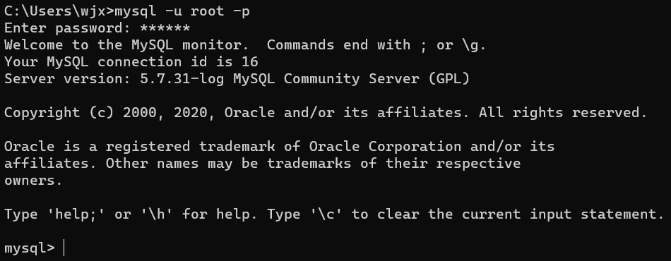


## 7.mysql常用命令：

- 退出mysql

```
exit
```

- 查看mysql中有哪些数据库

```
show databases；（注：以英文分号结尾）
```


- 选择使用某个数据库

```
use 数据库名称
```


- 创建数据库

```
create database 数据库名称;
```

- 查看某个数据库下的表

  要查看某个数据库中的表，必须先使用该数据库。

```
show tables;
```


- 查看数据库的版本号

```
select version();
```

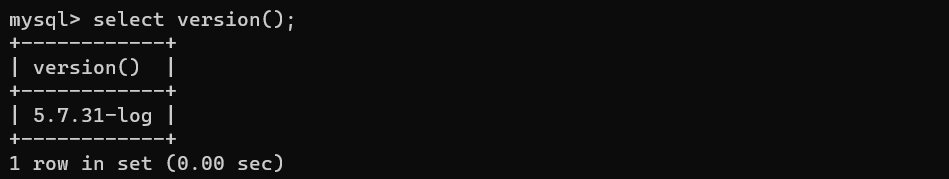

- 查看当前使用的是哪个数据库

```
select database();
```

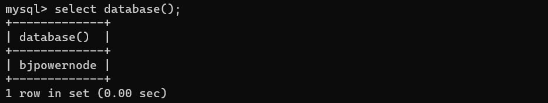

**注意**：mysql命令以英文“;”表示结束。只有输入分号之后命令才会执行。

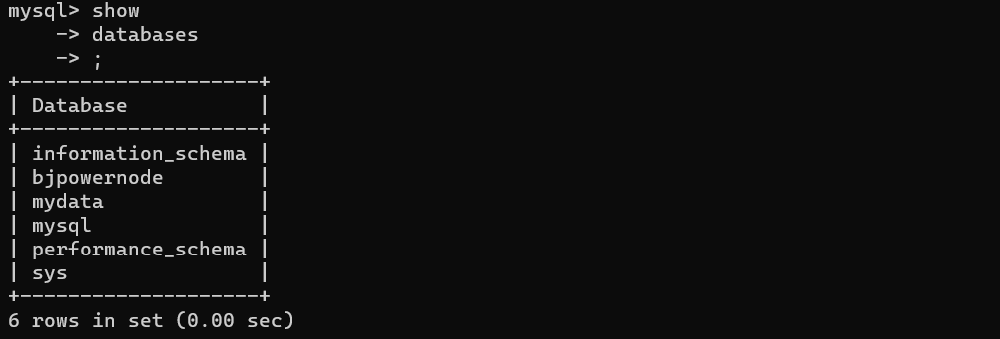

也可以使用“\c”来终止一条命令的输入。


## 8.数据库当中最基本的单元是表：table

什么是表table？为什么用表来存储数据呢？

​		姓名		性别		年龄(列：字段) 
​		张三		男			20            ------->行（记录）
​		李四		女			21            ------->行（记录）
​		王五		男			22            ------->行（记录）

数据库当中是以表格的形式表示数据的。因为表比较直观。

任何一张表都有行和列：
		行（row）：被称为数据/记录。
		列（column）：被称为字段。

每一个字段都有：字段名、数据类型、约束等属性。

- [ ] 字段名可以理解，是一个普通的名字，见名知意就行。
- [ ] 数据类型：字符串，数字，日期等，后期讲。
- [ ] 约束：约束也有很多，其中一个叫做唯一性约束，这种约束添加之后，该字段中的数据不能重复。


## 9.关于SQL语句的分类

SQL语句有很多，最好进行分门别类，这样更容易记忆。

- **DQL：数据查询语言**（凡是带有select关键字的都是查询语句）
  				select...

- **DML：数据操作语言**（凡是对表当中的数据进行增删改的都是DML）
  		insert delete update
    		insert 增
    		delete 删
    		update 改

​		这个主要是操作表中的数据data。

- **DDL：数据定义语言** （凡是带有create、drop、alter的都是DDL）。DDL主要操作的是表的结构。不是表中的数据。
  		create：新建，等同于增
    		drop：删除
    		alter：修改
    		这个增删改和DML不同，这个主要是对表结构进行操作。

- **TCL：事务控制语言**
  		包括：
    		事务提交：commit;
    		事务回滚：rollback;

- **DCL：数据控制语言。**
  		例如：授权grant、撤销权限revoke....


## 10.导入一下提前准备好的数据：

bjpowernode.sql文件是用来后续练习使用的数据库表。

- 导数sql文件中的数据

```mysql
source 文件路径
```

注意路径中不要出现中文！！！


## 11.查看表中数据和结构


dept是部门表
emp是员工表
salgrade 是工资等级表

- 查看表中的数据

```mysql
select * from 表名；
```

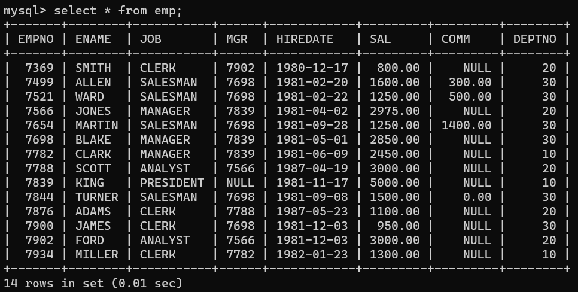

- 查看表的结构

```mysql
desc 表名；
```

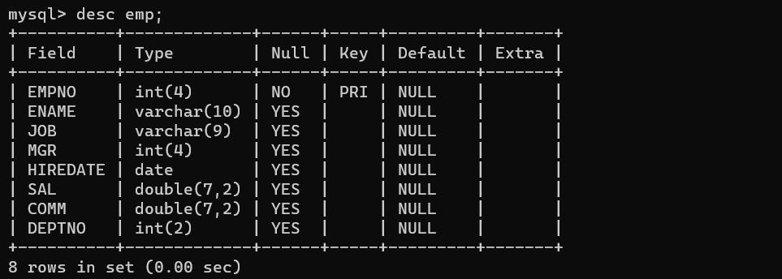

EMPNO：员工编号	ENAME：员工姓名	JOB：工作岗位	MRG：上级编号

HIREDATE：入职日期	SAL：工资	COMM：补助	DEPTNO：部门编号


DEPTNO：部门编号	DNAME：部门名称	LOC：地理位置

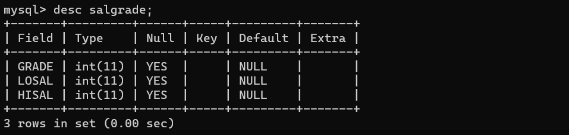

GRADE：工资等级	LOSAL：最低工资	HISAL：最高工资


## 12.简单查询

- 查询一个字段

```mysql
select 字段名 from 表名；
```

select和from都是关键字。字段名和表名都是标识符。

注意：所有的SQL语句都以“;”结尾，SQL语句不区分大小写。


- 查询两个字段

```mysql
select 字段名,字段名 from 表名；
```


- 查询所有字段

把所有字段名都写上，也可以使用“*”

```mysql
select * from 表名;
```

这种方式的缺点：效率低，可读性差，在实际开发中不建议，可以自己玩没问题。可以在DOS命令窗口中想快速的看一看全表数据可以采用这种方式。


- 给查询的列起别名

```mysql
select 字段名 as 别名 from 表名；
```

使用as关键字起别名。只是将显示的查询结果列名显示为deptname，原表列名还是叫：dname
记住：select语句是永远都不会进行修改操作的。（因为只负责查询）。as关键字可以省略。

- 别名里面有空格

```mysql
select 字段名 as '别 名' from 表名;
```

当别名里面有空格时，使用单引号将别名引起来。注意：在所有的数据库当中，字符串统一使用单引号括起来，单引号是标准，双引号在oracle数据库中用不了。但是在mysql中可以使用。

- 计算员工年薪

```mysql
select ename,sal*12 as yearsal from emp;
```


```mysql
select ename,sal*12 as '年薪' from emp;
```


## 13.条件查询

（1）什么是条件查询？不是将表中所有的数据都查出来，只查询出来符合条件的。

```mysql
select 
	字段1,字段2,字段3...
from 
	表名
where
	条件;
```

（2）都有哪些条件？

- **等于	=**

*查询薪资等于800的员工姓名和编号*

```mysql
select ename,empno,sal from emp where sal=800;
```

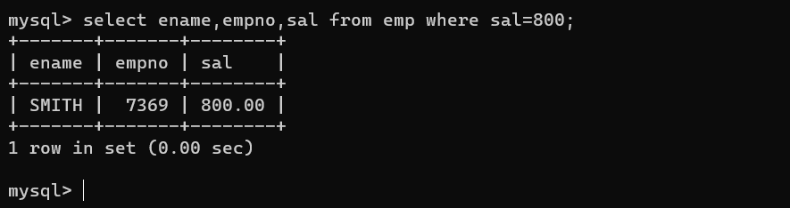

- **小于	<**

*查询薪资小于2000的员工信息*

```mysql
select empno,ename,sal from emp where sal<2000;
```


- **小于等于 	<=**

- **大于        >**

- **大于等于        >=**

  

- **between...and... 两个值之间，等同于>= and <=**         

*查询薪资在2450和3000之间的员工信息，包括2450和3000*

```mysql
select empno,ename,sal from emp where sal>= 2450 and sal<=3000;
```

and是并且的意思

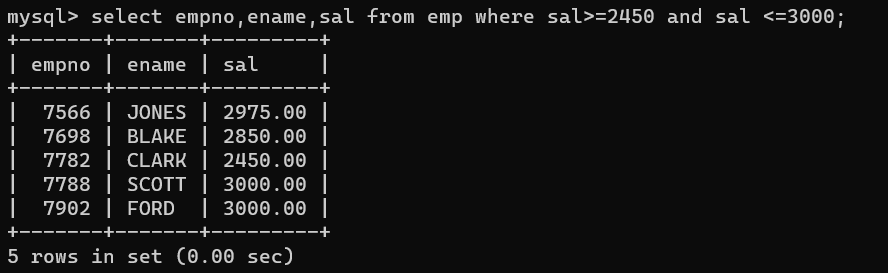

```mysql
select 
	empno,ename,sal
from
	emp
where
	sal between 2450 and 3000;
```

注意：使用between and的时候，必须遵循左小右大。between and是闭区间，包括两端的值。


- **is null / is not null**

*查询哪些员工的补助为null*

```mysql
select empno,enam,sal,comm from emp where comm is null;
```

注意：在数据库当中null不能使用等号进行衡量。需要使用is null。因为数据库中的null代表什么也没有，它不是一个值，所以不能使用等号衡量。

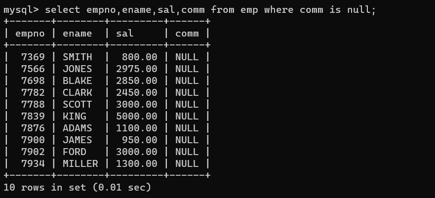


- 并且	and


*查询工作岗位是MANAGER并且工资大于2500的员工信息*

```mysql
 select empno,ename,sal,job from emp where job='MANAGER' and sal>2500;
```


- 或者	or

*查询工作岗位是MANAGER和SALESMAN的员工*

```mysql
select empno,ename,sal,job from emp where job='MANAGER' or job='SALESMAN';
```

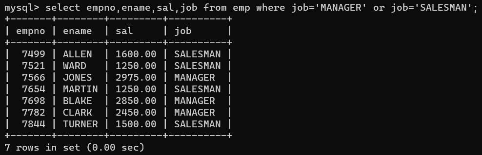


注意：and和or同时出现，and优先级较高。如果想让or先执行，需要加“小括号”。以后在开发中，如果不确定优先级，就加小括号就行了。

*查询工资大于2500，并且部门编号为10或20部门的员工*

```mysql
select empno,ename,sal,deptno from emp where sal>2500 and (deptno=10 or deptno =20);
```


- **包含	in	相当于多个or****

*查询工作岗位是MANAGER和SALESMAN的员工*

```mysql
select empno,ename,sal,job from emp where job='MANAGER' or job='SALESMAN';
select empno,ename,job from emp where job in ('MANAGER','SALESMAN');
```

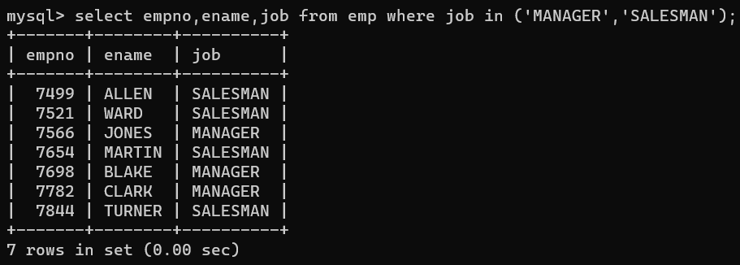


- **not 可以用来取非，主要用在is 和 in中**

- [ ] is null
- [ ] is not null
- [ ] in
- [ ] not in


- **like 模糊查询**

支持%或下划线匹配。

%匹配任意多个字符。

下划线：任意一个字符。

*找出名字中含有O的*

```mysql
select empno,ename from emp where ename like '%o%';
```


*找出名字以T结尾的*

```mysql
select ename from emp where ename like '%T';
```

*找出第二个字母是A的*

```mysql
select ename from emp where ename like '_A%';
```

*找出第三个字母是R的*

```mysql
select ename from emp where ename like '__R';
```

注意：如过要找的字符中含有“%”和“_”，需要使用转义字符“\”

*找出名字中有_的*

```mysql
select ename from emp where ename like '%\_';
```


## 14.排序

- **按单个字段升序**

*查询所有员工薪资，排序*

```mysql
select ename from emp order by sal;
```

注意：默认排序为升序，也可使用asc指定升序排序。


- **按单个字段降序**

*查询所有员工薪资，排序*

```mysql
select ename,sal from emp order by sal desc;
```


- 按多个字段排序

*查询员工名字和薪资，要求按照薪资升序，如果薪资一样的话，再按照名字升序排列。*

```mysql
select ename,sal from emp order by sal asc,ename asc;
```

注意：sal在前，起主导，只有sal相等的时候，才会考虑启用ename排序。


- **综合小案例**

*找出工资在1250到3000之间的员工信息，要求按照薪资降序排列。*

```mysql
select 
	ename,sal 
from 
	emp 
where 
	sal between 1250 and 3000 
order by 
	sal desc;
```


- **关键字顺序不能变**

```mysql
select
	...
from
	...
where
	...
order by
	...
```

注意：以上语句的执行顺序必须掌握：
	第一步：from
	第二步：where
	第三步：select
	第四步：order by（排序总是在最后执行！）


15.数据处理函数

