# 1.基本概念

## 1.概念

- **什么是数据库？什么是数据库管理系统？什么是SQL？他们之间的关系是什么？**

- **数据库**：英文单词DataBase，简称DB。按照一定格式存储数据的一些文件的组合。顾名思义：存储数据的仓库，实际上就是一堆文件。这些文件中存储了具有特定格式的数据。

- **数据库管理系统**：DataBaseManagement，简称DBMS。数据库管理系统是专门用来管理数据库中数据的，数据库管理系统可以对数据库当中的数据进行增删改查。

  常见的数据库管理系统：MySQL、Oracle、MS SqlServer、DB2、sybase等....

- **SQL：结构化查询语言**：程序员需要学习SQL语句，程序员通过编写SQL语句，然后DBMS负责执行SQL语句，最终来完成数据库中数据的增删改查操作。SQL是一套标准，程序员主要学习的就是SQL语句，这个SQL在mysql中可以使用，同时在Oracle中也可以使用，在DB2中也可以使用。

2.三者之间的关系？
DBMS--执行--> SQL --操作--> DB

先安装数据库管理系统MySQL，然后学习SQL语句怎么写，编写SQL语句之后，DBMS对SQL语句进行执行，最终来完成数据库的数据管理。


## 2.MySQL服务

- **看一下计算机上的服务，找一找MySQL的服务在哪里？**

计算机-->右键-->管理-->服务和应用程序-->服务-->找mysql服务。MySQL的服务，默认是“启动”的状态，只有	启动了mysql才能用。默认情况下是“自动”启动，自动启动表示下一次重启操作系统的时候，自动启动该服	务。

可以在服务上点击右键：
	启动
	重启服务
	停止服务
	...

还可以改变服务的默认配置：
	服务上点击右键，属性，然后可以选择启动方式：
	自动（延迟启动）
	自动
	手动
	禁用


- **在windows操作系统当中，怎么使用命令来启动和关闭mysql服务呢？**

语法：
	net stop 服务名称;
	net start 服务名称;

其它服务的启停都可以采用以上的命令。


- **mysql安装了，服务启动了，怎么使用客户端登录mysql数据库呢？**

- **显示登录密码的方式**

```
mysql -uroot -p123456
```

123456可以替换为自己的密码


- **不显示登录密码的方式**

```
mysql -u root -p
```

执行命令后输入密码即可登录	


## 

## 3.mysql常用命令

- 退出mysql

```
exit
```

- 查看mysql中有哪些数据库

```
show databases；（注：以英文分号结尾）
```


- 选择使用某个数据库

```
use 数据库名称
```


- 创建数据库

```
create database 数据库名称;
```

- 查看某个数据库下的表

  要查看某个数据库中的表，必须先使用该数据库。

```
show tables;
```

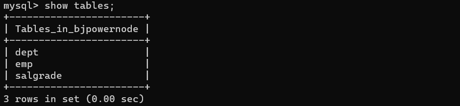

- 查看数据库的版本号

```
select version();
```


- 查看当前使用的是哪个数据库

```
select database();
```


**注意**：mysql命令以英文“;”表示结束。只有输入分号之后命令才会执行。


也可以使用“\c”来终止一条命令的输入。


## 4.表

数据库当中最基本的单元是表：table

什么是表table？为什么用表来存储数据呢？

​		姓名		性别		年龄(列：字段) 
​		张三		男			20            ------->行（记录）
​		李四		女			21            ------->行（记录）
​		王五		男			22            ------->行（记录）

数据库当中是以表格的形式表示数据的。因为表比较直观。

任何一张表都有行和列：
		行（row）：被称为数据/记录。
		列（column）：被称为字段。

每一个字段都有：字段名、数据类型、约束等属性。

- [ ] 字段名可以理解，是一个普通的名字，见名知意就行。
- [ ] 数据类型：字符串，数字，日期等，后期讲。
- [ ] 约束：约束也有很多，其中一个叫做唯一性约束，这种约束添加之后，该字段中的数据不能重复。


## 5.SQL语句的分类

SQL语句有很多，最好进行分门别类，这样更容易记忆。

- **DQL：数据查询语言**（凡是带有select关键字的都是查询语句）
  				select...

- **DML：数据操作语言**（凡是对表当中的数据进行增删改的都是DML）
  		insert delete update
    		insert 增
    		delete 删
    		update 改

​		这个主要是操作表中的数据data。

- **DDL：数据定义语言** （凡是带有create、drop、alter的都是DDL）。DDL主要操作的是表的结构。不是表中的数据。
  		create：新建，等同于增
    		drop：删除
    		alter：修改
    		这个增删改和DML不同，这个主要是对表结构进行操作。

- **TCL：事务控制语言**
  		包括：
    		事务提交：commit;
    		事务回滚：rollback;

- **DCL：数据控制语言。**
  		例如：授权grant、撤销权限revoke....


## **6.导入数据**

- **导入一下提前准备好的数据**

bjpowernode.sql文件是用来后续练习使用的数据库表。

- 导数sql文件中的数据

```mysql
source 文件路径
```

注意路径中不要出现中文！！！


# 2.DQL语句


## 1.查看表中数据和结构


dept是部门表
emp是员工表
salgrade 是工资等级表

- 查看表中的数据

```mysql
select * from 表名；
```


- 查看表的结构

```mysql
desc 表名；
```


EMPNO：员工编号	ENAME：员工姓名	JOB：工作岗位	MRG：上级编号

HIREDATE：入职日期	SAL：工资	COMM：补助	DEPTNO：部门编号

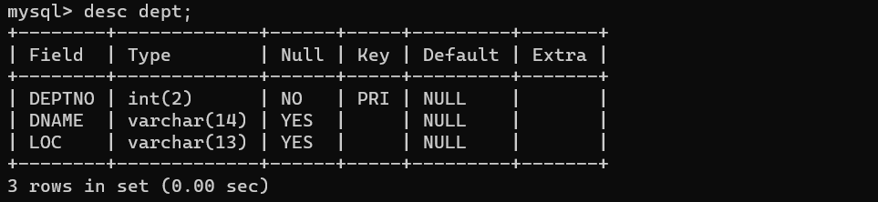

DEPTNO：部门编号	DNAME：部门名称	LOC：地理位置


GRADE：工资等级	LOSAL：最低工资	HISAL：最高工资


## 2.简单查询

- 查询一个字段

```mysql
select 字段名 from 表名；
```

select和from都是关键字。字段名和表名都是标识符。

注意：所有的SQL语句都以“;”结尾，SQL语句不区分大小写。

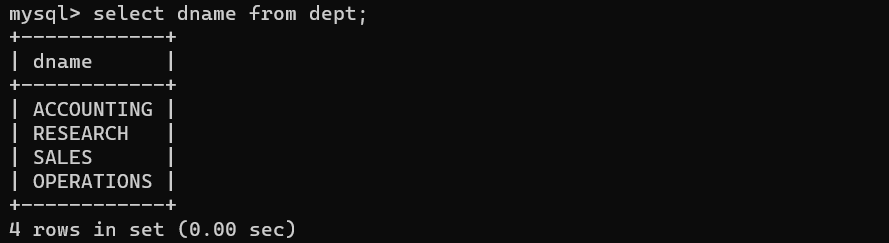

- 查询两个字段

```mysql
select 字段名,字段名 from 表名；
```

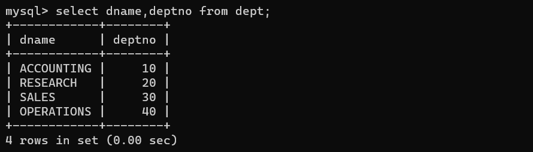

- 查询所有字段

把所有字段名都写上，也可以使用“*”

```mysql
select * from 表名;
```

这种方式的缺点：效率低，可读性差，在实际开发中不建议，可以自己玩没问题。可以在DOS命令窗口中想快速的看一看全表数据可以采用这种方式。


- 给查询的列起别名

```mysql
select 字段名 as 别名 from 表名；
```

使用as关键字起别名。只是将显示的查询结果列名显示为deptname，原表列名还是叫：dname
记住：select语句是永远都不会进行修改操作的。（因为只负责查询）。as关键字可以省略。

- 别名里面有空格

```mysql
select 字段名 as '别 名' from 表名;
```

当别名里面有空格时，使用单引号将别名引起来。注意：在所有的数据库当中，字符串统一使用单引号括起来，单引号是标准，双引号在oracle数据库中用不了。但是在mysql中可以使用。

- 计算员工年薪

```mysql
select ename,sal*12 as yearsal from emp;
```

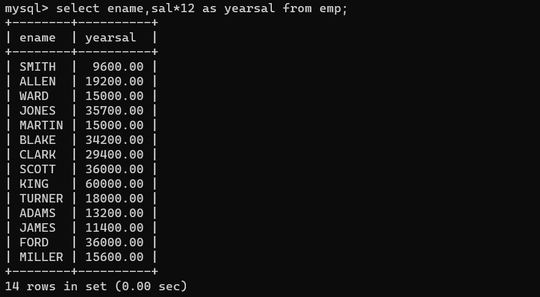

```mysql
select ename,sal*12 as '年薪' from emp;
```

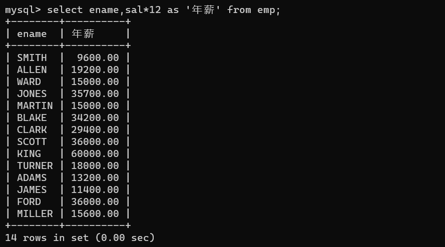


## 3.条件查询

（1）什么是条件查询？不是将表中所有的数据都查出来，只查询出来符合条件的。

```mysql
select 
	字段1,字段2,字段3...
from 
	表名
where
	条件;
```

（2）都有哪些条件？

- **等于	=**

*查询薪资等于800的员工姓名和编号*

```mysql
select ename,empno,sal from emp where sal=800;
```


- **不等于	<>或!=**
- **小于	<**

*查询薪资小于2000的员工信息*

```mysql
select empno,ename,sal from emp where sal<2000;
```

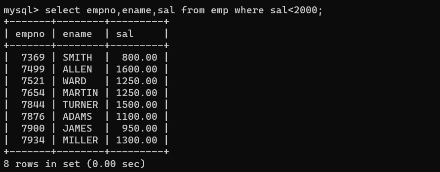

- **小于等于 	<=**

- **大于        >**

- **大于等于        >=**

  

- **between...and... 两个值之间，等同于>= and <=**         

*查询薪资在2450和3000之间的员工信息，包括2450和3000*

```mysql
select empno,ename,sal from emp where sal>= 2450 and sal<=3000;
```

and是并且的意思


```mysql
select 
	empno,ename,sal
from
	emp
where
	sal between 2450 and 3000;
```

注意：使用between and的时候，必须遵循左小右大。between and是闭区间，包括两端的值。


- **is null / is not null**

*查询哪些员工的补助为null*

```mysql
select empno,enam,sal,comm from emp where comm is null;
```

注意：在数据库当中null不能使用等号进行衡量。需要使用is null。因为数据库中的null代表什么也没有，它不是一个值，所以不能使用等号衡量。


- 并且	and


*查询工作岗位是MANAGER并且工资大于2500的员工信息*

```mysql
 select empno,ename,sal,job from emp where job='MANAGER' and sal>2500;
```

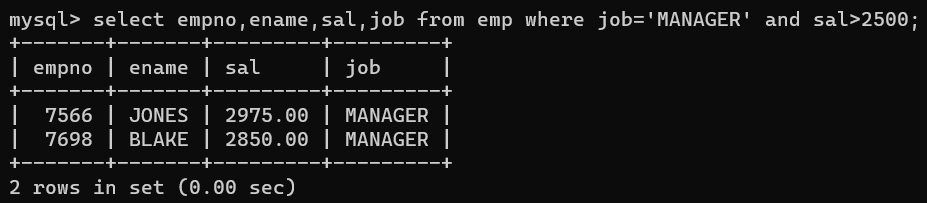


- 或者	or

*查询工作岗位是MANAGER和SALESMAN的员工*

```mysql
select empno,ename,sal,job from emp where job='MANAGER' or job='SALESMAN';
```


注意：and和or同时出现，and优先级较高。如果想让or先执行，需要加“小括号”。以后在开发中，如果不确定优先级，就加小括号就行了。

*查询工资大于2500，并且部门编号为10或20部门的员工*

```mysql
select empno,ename,sal,deptno from emp where sal>2500 and (deptno=10 or deptno =20);
```


- **包含	in	相当于多个or****

*查询工作岗位是MANAGER和SALESMAN的员工*

```mysql
select empno,ename,sal,job from emp where job='MANAGER' or job='SALESMAN';
select empno,ename,job from emp where job in ('MANAGER','SALESMAN');
```


- **not 可以用来取非，主要用在is 和 in中**

- [ ] is null
- [ ] is not null
- [ ] in
- [ ] not in


- **like 模糊查询**

支持%或下划线匹配。

%匹配任意多个字符。

下划线：任意一个字符。

*找出名字中含有O的*

```mysql
select empno,ename from emp where ename like '%o%';
```

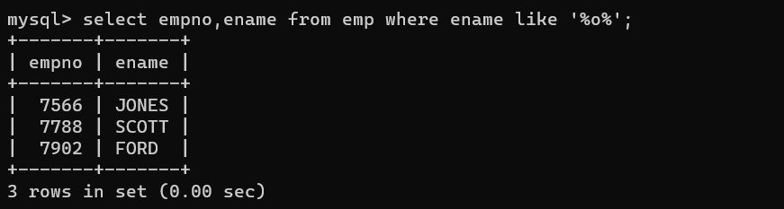

*找出名字以T结尾的*

```mysql
select ename from emp where ename like '%T';
```

*找出第二个字母是A的*

```mysql
select ename from emp where ename like '_A%';
```

*找出第三个字母是R的*

```mysql
select ename from emp where ename like '__R';
```

注意：如过要找的字符中含有“%”和“_”，需要使用转义字符“\”

*找出名字中有_的*

```mysql
select ename from emp where ename like '%\_';
```


## 4.排序

- **按单个字段升序**

*查询所有员工薪资，排序*

```mysql
select ename from emp order by sal;
```

注意：默认排序为升序，也可使用asc指定升序排序。


- **按单个字段降序**

*查询所有员工薪资，排序*

```mysql
select ename,sal from emp order by sal desc;
```

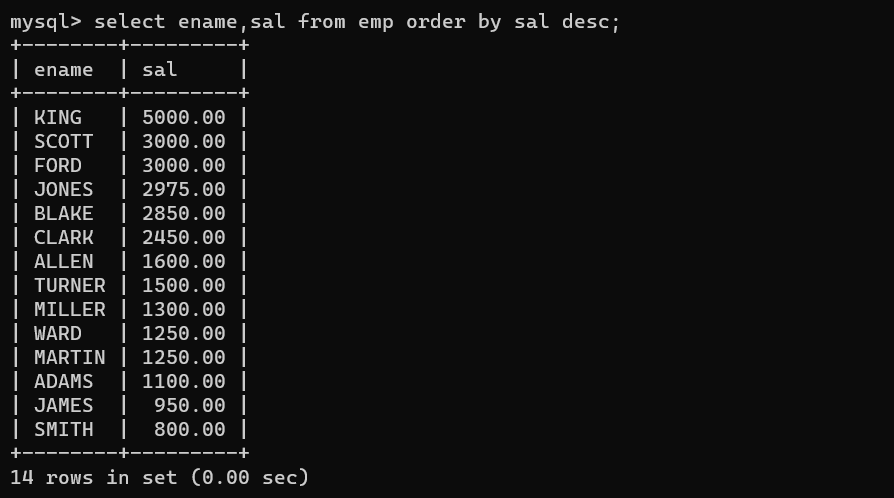


- 按多个字段排序

*查询员工名字和薪资，要求按照薪资升序，如果薪资一样的话，再按照名字升序排列。*

```mysql
select ename,sal from emp order by sal asc,ename asc;
```

注意：sal在前，起主导，只有sal相等的时候，才会考虑启用ename排序。


- **综合小案例**

*找出工资在1250到3000之间的员工信息，要求按照薪资降序排列。*

```mysql
select 
	ename,sal 
from 
	emp 
where 
	sal between 1250 and 3000 
order by 
	sal desc;
```


- **关键字顺序不能变**

```mysql
select
	...
from
	...
where
	...
order by
	...
```

注意：以上语句的执行顺序必须掌握：
	第一步：from
	第二步：where
	第三步：select
	第四步：order by（排序总是在最后执行！）


## 5.数据处理函数

单行处理函数的特点：一个输入对应一个输出。

和单行处理函数相对的是：多行处理函数。（多行处理函数特点：多个输入，对应1个输出！）

常见的单行处理函数：

- **lower	转换小写**

```mysql
select lower(ename) from emp;
```

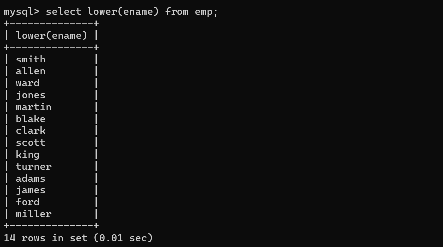

- **upper	转换大写**
- **substr        取字串**

substr(被截取的字符串，起始下标，截取的长度)

起始下标从1开始，没有0

```mysql
select substr(ename,1,1) from emp;
```


*找出员工名字第一个字母是A的员工信息*

```mysql
//方式一：模糊查询
select ename from emp where ename like 'A%';
//方式二：substr()
select ename from emp where substr(ename,1,1)='A';
```


*查询员工的姓名，并将首字母大写*

```mysql
select
	concat(substr(ename,1,1),lower(substr(ename,2,length(ename) - 1))) 
as 
	result
from 
	emp;
```


- **concat	字符串拼接函数**

```mysql
select concat(empno,ename) from emp;
```


- **length	取长度**

```mysql
select length(ename) from emp;
```

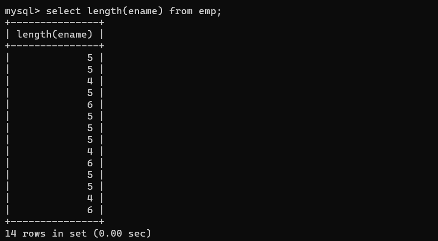


- **trim	去空格**

```mysql
select ename from emp where ename = trim('   KING');
```


- **case..when..then..when..then..else..end**

*当员工的工作岗位是MANAGER的时候，工资上调10%，当工作岗位是SALESMAN的时候，工资上调50%,其它正常。（注意：不修改数据库，只是将查询结果显示为工资上调）*

```mysql
select 
	ename,job,sal as oldsal,
	(case job when 'MANAGER' then sal*1.1
			  when 'SALESMAN' then sal*1.5
			  else sal
			  end) as newsal
from 
	emp;
```


- round	四舍五入

```mysql
select 'abc' from emp;
```

select后直接跟字面量


*保留整数位*

```mysql
select round(1236.567,0) as result from emp;
```

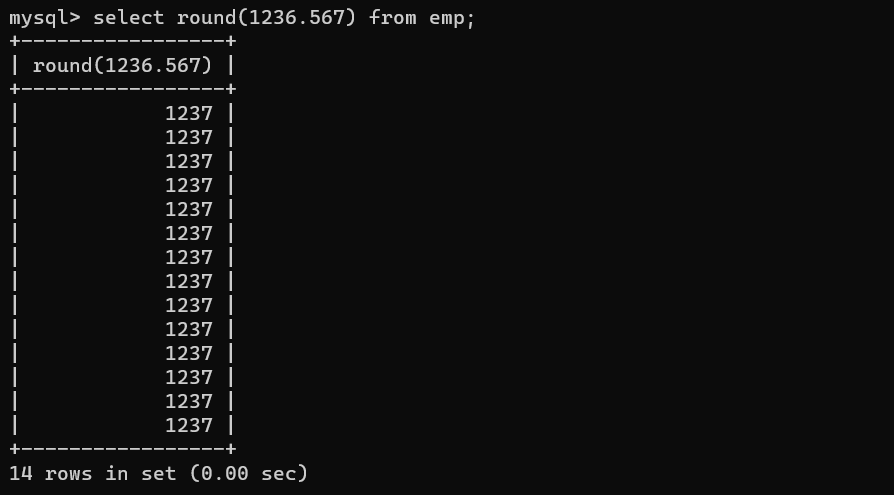

*保留一位小数*

```mysql
select round(1236.567,1) from emp;
```


*保留到十位*

```mysql
select round(1236.567,-1) as result from emp;
```


- **rand()	生成随机数**

```mysql
select rand() from emp;
```

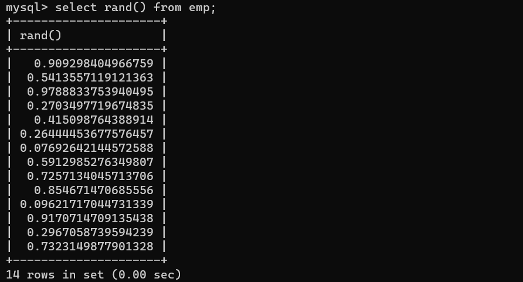


- **ifnull	空处理函数**

ifnull是空处理函数。专门处理空的。在所有数据库当中，只要有NULL参与的数学运算，最终结果就是NULL。

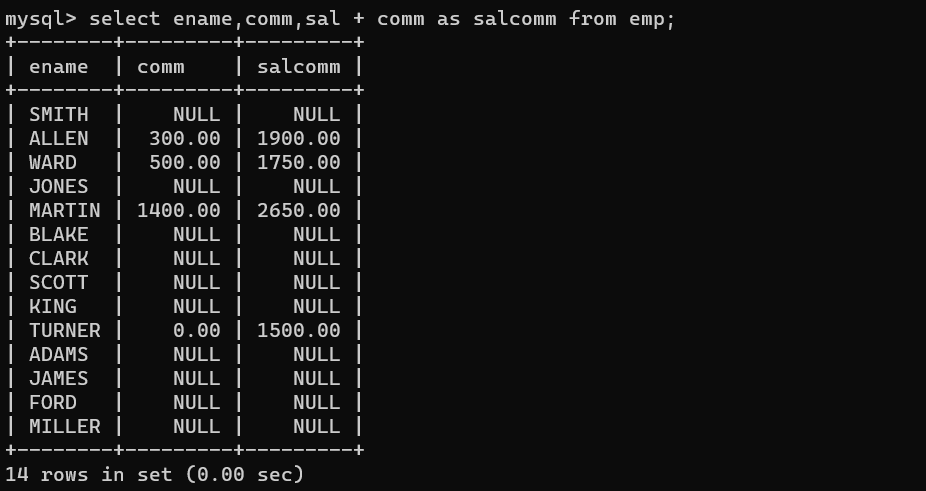

因为comm字段中有的值为NULL，参与运算之后，最终的结果为NULL。为了避免这个现象，需要使用ifnull函数。

ifnull(数据，被当做哪个值)

*计算每个员工的年薪	年薪 = (月薪 + 月补助)  × 12*

```mysql
select ename,(sal + ifnull(comm,0)) * 12 as yearsal from emp;
```

补助comm为NULL时，将补助当做0。

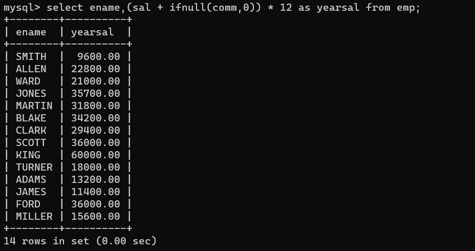


## 6.分组函数

分组函数又称多行处理函数，多行处理函数的特点是：输入多行，最终输出一行。

​	count()	计数

​	sum()	求和

​	avg()	求平均值

​	max()	最大值

​	min()	最小值


*找出最高工资*

```mysql
select max(sal) from emp;
```


*找出最低工资*

```mysql
select min(sal) from emp;
```


*计算工资和*

```mysql
select sum(sal) from emp;
```


*计算平均工资*

```mysql
select avg(sal) from emp;
```


*计算员工数量*

```mysql
select count(ename) from emp;
```


注意：

①分组函数在使用的时候必须先进行分组，然后才能使用。如果没有对数据进行分组，整张表默认为一组。

②分组函数自动忽略NULL，不需要对NULL进行处理，比如使用sum()求和时，不用专门针对NULL进行任何处理

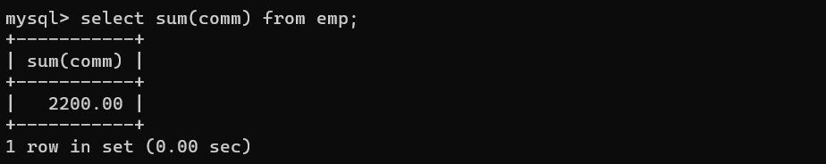

③分组函数中count(*)和count(具体字段)的区别。


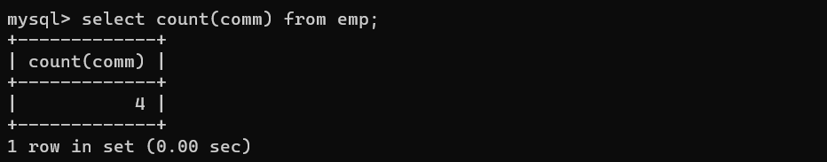

count(具体字段)：表示统计该字段下所有不为NULL的元素的总数。

count(*)：统计表当中的总行数。（只要有一行数据count则++）因为每一行记录不可能都为NULL，一行数据中有一列不为NULL，则这行数据就是有效的。

④分组函数不能够直接使用在where子句中，在分组查询group by解释。

⑤所有的分组函数可以组合起来一起用。

```mysql
select max(sal),min(sal),sum(sal),avg(sal),count(*) from emp;
```


## 7.分组查询※

- **什么是分组查询？**

在实际的应用中，可能有这样的需求，需要先进行分组，然后对每一组的数据进行操作。这个时候我们需要使用分组查询，怎么进行分组查询呢？
			

```mysql
select
	...
from
	...
group by
	...
```

例如：

计算每个部门的工资和？	计算每个工作岗位的平均薪资？	找出每个工作岗位的最高薪资？	....


- **关键字的执行顺序**

```mysql
select
	...
from
	...
where
	...
group by
	...
having
	...
order by
	...
```

关键字的顺序不能颠倒。

执行顺序为：

from	→	where	→	group by	→	having	→	select	→	order by


- **为什么分组函数不能直接使用在where后面？**

select ename,sal from emp where sal > min(sal);//报错。

因为分组函数在使用的时候必须先分组之后才能使用。where执行的时候，还没有分组。所以where后面不能出现分组函数。

select sum(sal) from emp; 

这个没有分组，为啥sum()函数可以用呢？因为select在group by之后执行。


- ***找出每个工作岗位的工资和***

```mysql
select job,sum(sal) from emp group by job
```

以上这个语句的执行顺序：先从emp表中查询数据；根据job字段进行分组；然后对每一组的数据进行sum(sal)


**在一条select语句当中，如果有group by语句的话，select后面只能跟：参加分组的字段，以及分组函数。其它的一律不能跟。**


- ***找出每个部门的最高薪资***

```mysql
select deptno,max(sal) from emp group by deptno;
```


- ***找出“每个部门，不同工作岗位”的最高薪资***

```mysql
select deptno,job,max(sal) from emp group by deptno,job;
```

两个字段联合分组


- ***使用having可以对分完组之后的数据进一步过滤***

having不能单独使用，having不能代替where，having必须和group by联合使用。


- ***找出每个部门最高薪资，要求显示最高薪资大于3000的***

```mysql
select deptno,max(sal) from emp group by deptno having max(sal) > 3000;
```


思考一个问题：以上的sql语句执行效率是不是低？

比较低，实际上可以这样考虑：先将大于3000的都找出来，然后再分组。

```mysql
select deptno,max(sal) from emp where sal > 3000 group by deptno;
```

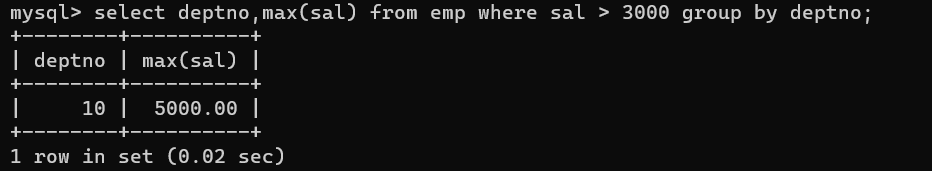

where和having，优先选择where，where实在完成不了了，再选择having。


- **找出每个岗位的平均薪资，要求显示平均薪资大于1500的，除MANAGER岗位之外，要求按照平均薪资降序排**

```mysql
select
	job,avg(sal) as avgsal
from 
	emp
where
	job <> 'MANAGER'
group by
	job
ordre by
	avgsal desc;
```

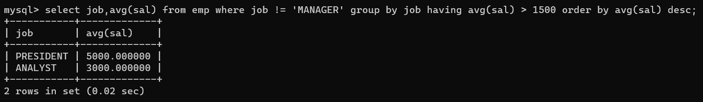


- ***distinct	把查询结果去除重复记录***

注意：原表数据不会修改，只是查询结果去重。

distinct只能出现在所有字段的最前方

```mysql
select distinct job from emp;
```

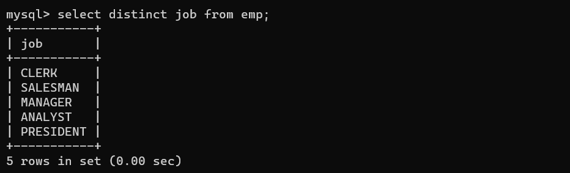

```mysql
select distinct job,deptno from emp;
```

distinct出现在两个字段之前，表示两个字段联合起来去重。


*统计岗位数量*

```mysql
select count(distinct job) from emp;
```


## 8.连接查询

- **什么是连接查询？**

从一张表中单独查询，称为**单表查询**。emp表和dept表联合起来查询数据，从emp表中取员工名字，从dept表中取部门名字。这种跨表查询，多张表联合起来查询数据，被称为**连接查询**。


- **连接查询的分类**

**根据语法的年代分类：**

SQL92：1992年的时候出现的语法

SQL99：1999年的时候出现的语法

我们这里重点学习SQL99.(这个过程中简单演示一个SQL92的例子)
	

**根据表连接的方式分类：**

内连接：等值连接，非等值连接，自连接

外连接：左外连接（左连接），右外连接（右连接），全连接（不讲）


- **当两张表进行连接查询时，没有任何条件的限制会发生什么现象？**

*查询每个员工所在部门名称*

```mysql
select ename,dname from emp,dept;
```

两张表连接没有任何条件限制

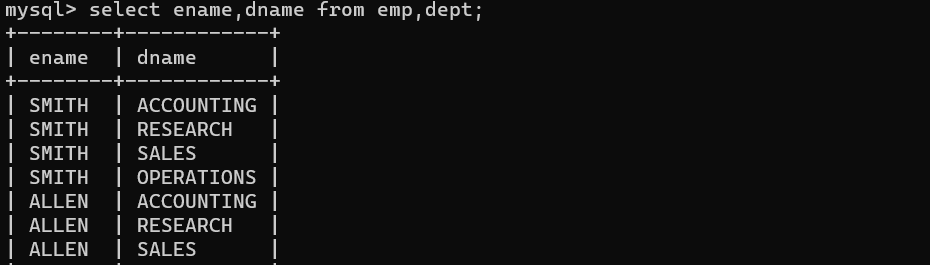

当两张表进行连接查询，没有任何条件限制的时候，最终查询结果条数，是两张表条数的乘积，这种现象被称为：笛卡尔积现象。（笛卡尔发现的，这是一个数学现象。）


- **如何避免笛卡尔积现象？**

连接查询时加条件限制，满足这个条件的记录会被筛选出来。

*查询每个员工所在部门名称*

```mysql
#方式一
select
	ename,dname
from 
	emp,dept
where
	emp.deptno = dept.deptno;
```

```mysql
#方式二
select
	emp.ename,dept.dname
from
	emp,dept
where
	emp.deptno = dept.deptno;
/*
	给表起别名很重要，涉及到效率问题。有别名后，如上例所示，ename会直接在emp表中找，
	不会再去dept表中找，dname也是同样的道理，从而提高了查询效率。
*/
```

```mysql
#方式三
#SQL92语法
select 
	e.ename,d,dname
from 
	emp e,dept d
where
	e.deptno = d.deptno;
```


思考：最终查询的结果条数是14条，但是匹配的过程中，匹配的次数减少了吗？还是56次，只不过进行了四选一。次数没有减少。

注意：通过笛卡尔积现象得出，表的连接次数越多效率越低，尽量避免表的连接次数。


- **内连接之等值连接**

*查询每个员工所在部门名称，显示员工名和部门名*

思路：emp e和dept d表进行连接。条件是：e.deptno = d.deptno

```mysql
#SQL92语法
select
	e.ename,d.dname
from 
	emp e,dept d
where
	e.deptno = d.deptno;
/*
	sql92的缺点：结构不清晰，表的连接条件，和后期进一步筛选的条件，都放到了where后面。
*/
```

```mysql
#SQL99语法
select
	e.ename,d.dname
from
	emp e
inner join #inner可以省略，带着可读性好
	dept d
on
	e.deptno = d.deptno; #条件是等量关系，所以称为等值连接。
/*
	sql99优点：表连接的条件是独立的，连接之后，如果还需要进一步筛选，再往后继续添加where
*/
```


- **SQL99语法**

```mysql

select 
	...
from
	a
join
	b
on
	a和b的连接条件
where
	筛选条件
```


- **内连接之非等值连接**

*找出每个员工的薪资等级，要求显示员工名、薪资、薪资等级。*

```mysql
select 
	e.ename,e.sal,s.grade
from 
	emp e
join
	salgrade s
on
	e.sal between s.losal and s.hisal;#条件不是一个等量关系，称为非等值连接
```


- **内连接之自连接**

*查询员工的上级领导，要求显示员工名和对应领导名*

思路：将一张表看做两张表

```mysql
select 
	a.ename,b.ename
from
	emp a
join
	emp b
on
	a.mgr = b.empno; #员工的领导编号=领导的员工编号
```


注意：查询结果只有13条记录，KING没有上级领导，所以没有显示。

```mysql
#内连接：A和B两张表没有主次关系，平等的。
select
	a.xxx,b.xxx
from 
	... a
join
	... b
on
	a.xxx = b.xxx #内连接的特点，完全能够匹配上这个条件的数据查询出来
```


- **外连接（右外连接）**

```mysql
select
	e.ename,d.dname
from
	emp e
right outer join #outer可以省略，带着可读性强
	dept d
on
	e.deptno = d.deptno;
/*
	right代表什么：表示将join关键字右边的这张表看成主表，主要是为了将
	这张表的数据全部查询出来，捎带着关联查询左边的表。
	在外连接当中，两张表连接，产生了主次关系。
*/
```


- **外连接（左外连接）**

```mysql
select
	e.ename,d.dname
from
	dept d
left join
	emp e
on e.deptno = d.deptno;
/*
	带有right的是右外连接，又叫做右连接。
	带有left的是左外连接，又叫做左连接。
	任何一个右连接都有左连接的写法。
	任何一个左连接都有右连接的写法。
	外连接的查询结果条数一定是 >= 内连接的查询结果条数
*/
```


*查询每个员工的上级领导，要求显示所有员工的名字和领导名*

```mysql
select
	a.ename as '员工名',b.ename as '领导名'
from
	emp a
left join
	emp b
on
	a.mgr = b.empno;
```

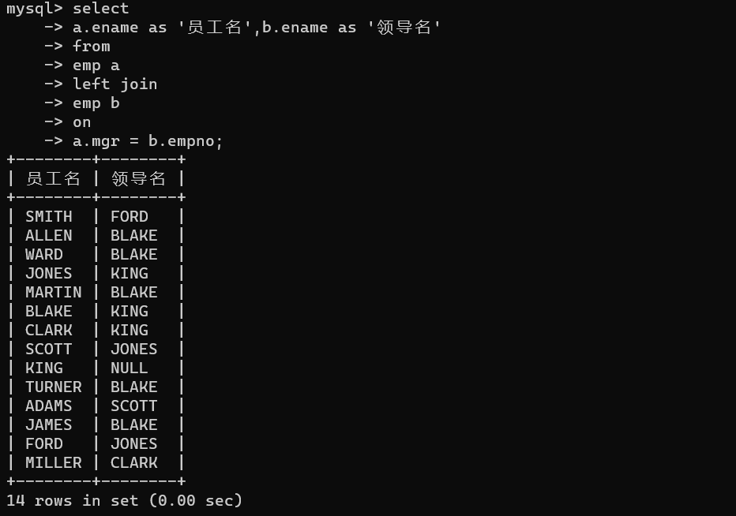


- **多张表连接查询**

```mysql
#语法：
select 
	...
from
	a
join
	b
on
	a和b的连接条件
join
	c
on
	a和c的连接条件
right join
	d
on
	a和d的连接条件

#一条SQL中内连接和外连接可以混合。都可以出现！
```


*找出每个员工的部门名称以及工资等级，要求显示员工名、部门名、薪资、薪资等级*

```mysql
select 
	e.ename,d.dname,e.sal,s.grade
from
	emp e
join
	dept d
on
	e.deptno = d.deptno
join
	salgrade s
on
	e.sal between s.losal and s.hisal;
```

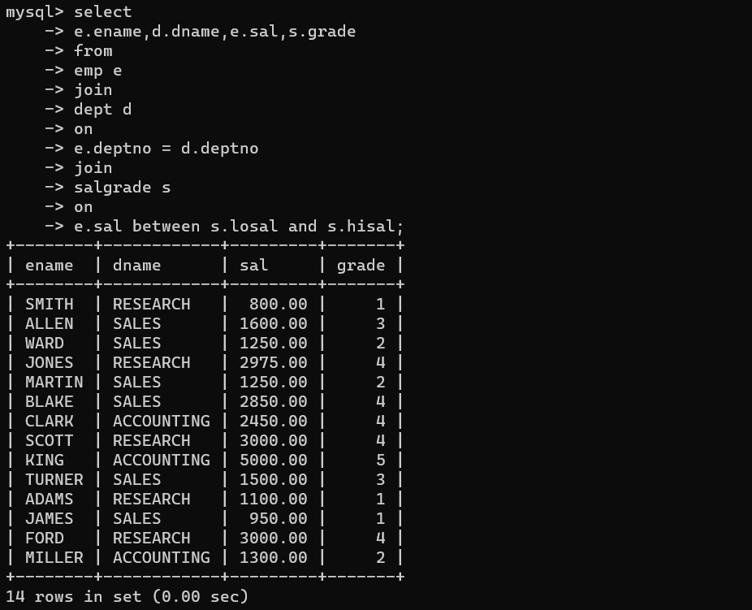


*找出每个员工的部门名称、工资等级以及上级领导，要求显示员工名、领导名、部门名、薪资、薪资等级*

```mysql
select
	a.ename as '员工名',b.ename as '领导名',d.dname,a.sal,s.grade
from
	emp a
left join
	emp b
on
	a.mgr = b.empno;
join
	dept d
on
	a.deptno = d.deptno
join
	salgrade s
on
	a.sal between s.lowsal and s.hisal;
```

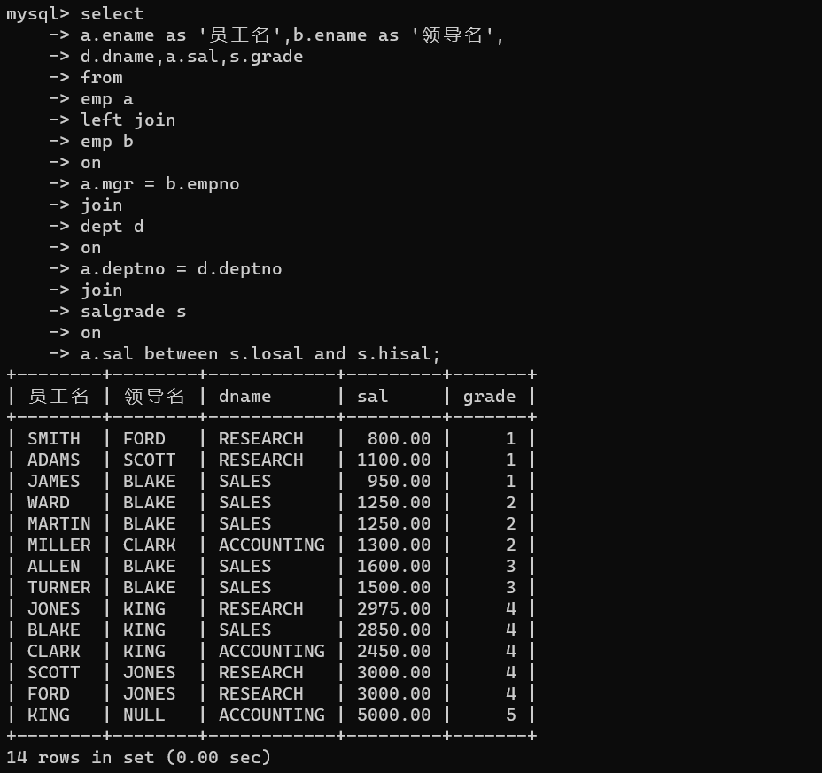


## 9.子查询

- **什么是子查询？**

select语句中嵌套select语句，被嵌套的select语句称为子查询。


- **子查询出现的位置**

```mysql
select
	..(select).
from
	..(select).
where
	..(select).
```


- **where子句中的子查询**

*找出比最低工资高的员工姓名和工资*

实现思路：

第一步：查询最低工资是多少

```mysql
select min(sal) from emp;
```

第二步：找出工资>800的

```mysql
select ename,sal from emp where sal > 800;
```

第三步：合并

```mysql
select ename,sal from emp where sal > (select min(sal) from emp);
```

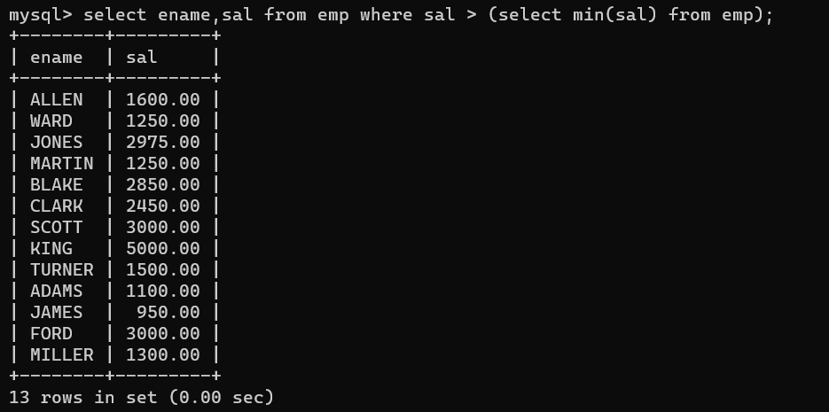


- **from子句中的子查询**

注意：from后面的子查询，可以将子查询的查询结果当做一张临时表。（技巧）

*找出每个岗位的平均工资的薪资等级*

第一步：找出每个岗位的平均工资

```mysql
select job,avg(sal) from emp order by job;
```

第二步：把第一步的查询结果当做一张真实存在的表t，用表t和薪资等级表s进行连接

```mysql
select 
	t.*,s.grade
from
	(select job,avg(sal) as avgsal from emp group by job) t
join
	salgrade s
on
	t.avgsal between s.losal and s.hisal;
```


- **select后面的子查询**（了解）

*找出每个员工的部门名称，要求显示员工名，部门名*

```mysql
select
	e.ename,e.deptno,(select d.dname from dept d where e.deptno = d.deptno) as dname
from 
	emp e;
```


注意：对于select后面的子查询来说，这个子查询只能一次返回1条结果，多于1条，就报错！


## 10.union

union用来合并查询结果集

*查询工作岗位是MANAGER和SALESMAN的员工*

```mysql
select ename,job from emp where job = 'MANAGER' or job = 'SALESMAN';
```

```mysql
select ename,job from emp where job in('MANAGER','SALESMAN');
```

```mysql
select ename job from emp where job = 'MANAGER'
union
select ename job from emp where job = 'SALESMAN';
```

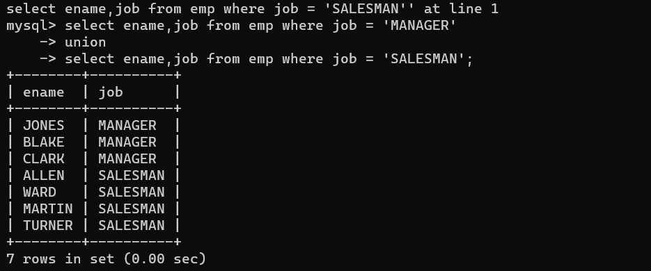

union的效率要高一些。对于表连接来说，每连接一次新表，则匹配的次数满足笛卡尔积，成倍的翻。但是union可以减少匹配的次数。在减少匹配次数的情况下，还可以完成两个结果集的拼接。

a 连接 b 连接 c
	a 10条记录
	b 10条记录
	c 10条记录
	匹配次数是：1000

a 连接 b一个结果：10 * 10 --> 100次
a 连接 c一个结果：10 * 10 --> 100次
使用union的话是：100次 + 100次 = 200次。（union把乘法变成了加法运算）

注意：union在进行结果集合并的时候，要求两个结果集的列数相同，列和列的数据类型要一致。


## 11.limit※

- **limit的作用**

将查询结果集的一部分取出来。通常使用在分页查询当中。百度默认：一页显示10条记录。分页的作用是为了提高用户的体验，因为一次全部都查出来，用户体验差。可以一页一页翻页看。


- **limit的使用**

完整用法：limit startIndex, length
		   startIndex是起始下标，length是长度。
		   起始下标从0开始。

缺省用法：limit 5; 这是取前5.

注意：mysql中limit在order by之后执行。

*按照薪资降序，取出排名在前5名的员工*

```mysql
select
	ename,sal
from 
	emp
order by 
	sal desc
limit 0,5
```

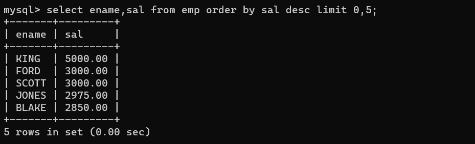


*取出工资排名在5-9名的员工*

```mysql
select ename,sal from emp order by sal desc limit 4,5;
```


- **分页**

每页显示3条记录
	第1页：limit 0,3		[0    1    2]
	第2页：limit 3,3		[3    4    5]
	第3页：limit 6,3		[6    7    8]
	第4页：limit 9,3		[9   10 11]

每页显示pageSize条记录
	第pageNo页：limit (pageNo - 1) * pageSize  , pageSize

记公式：
	limit (pageNo-1)*pageSize , pageSize


## 12.DQL语句总结

```mysql
select 
	...
from
	...
where
	...
group by
	...
having
	...
order by
	...
limit
	...

/*
	执行顺序？
		1.from
		2.where
		3.group by
		4.having
		5.select
		6.order by
		7.limit..
*/
```


# 3.DML&DDL语句

## 1.表的创建

- **建表的语法格式**

建表属于DDL语句，DDL包括：create drop alter

```mysql
create table 表名(字段名1 数据类型, 字段名2 数据类型, 字段名3 数据类型);

create table 表名(
	字段名1 数据类型, 
	字段名2 数据类型, 
	字段名3 数据类型
);
/*
	表名：建议以t_ 或者 tbl_开始，可读性强。见名知意。
	字段名：见名知意。
	表名和字段名都属于标识符。
*/
```


- **mysql中的数据类型**

**varchar(最长255)**

可变长度的字符串；比较智能，节省空间；会根据实际的数据长度动态分配空间。

优点：节省空间

缺点：需要动态分配空间，速度慢。

**char(最长255)**

定长字符串，不管实际的数据长度是多少，分配固定长度的空间去存储数据。使用不恰当的时候，可能会导致空间的浪费。

优点：不需要动态分配空间，速度快。

缺点：使用不当可能会导致空间的浪费。

varchar和char我们应该怎么选择？

性别字段你选什么？因为性别是固定长度的字符串，所以选择char。

姓名字段你选什么？每一个人的名字长度不同，所以选择varchar。

**int(最长11)**

数字中的整数型。等同于java的int。

**bigint**

数字中的长整型。等同于java中的long。

**float**	

单精度浮点型数据

**double**

双精度浮点型数据

**date**

短日期类型

**datetime**

长日期类型

**clob**

字符大对象，最多可以存储4G的字符串。

比如：存储一篇文章，存储一个说明。

超过255个字符的都要采用CLOB字符大对象来存储。

Character Large OBject:CLOB

**blob**

二进制大对象

Binary Large OBject

专门用来存储图片、声音、视频等流媒体数据。往BLOB类型的字段上插入数据的时候，例如插入一个图片、视频等，需要使用IO流才行。


- **创建一个学生表**

学号、姓名、年龄、性别、邮箱地址

```mysql
create table t_student(
	no int,
	name varchar(32),
	sex char(1),
	age int(3),
	email varchar(255)
);
```


- **删除表**

```mysql
drop table t_student; #当这张表不存在时会报错
```

```mysql
drop table if exists t_student; #如果这张表存在的话，删除
```


- **插入数据insert**

```mysql
#语法格式
insert into 表名(字段名1，字段名2，字段名3...) values(值1，值2，值3);

#注意：字段名和值要一一对应：数量要对应，数据类型要对应。
#insert语句执行成功的话，表中一定会多一条记录，没有给其他字段指定值的话，默认值为NULL
#insert语句中的“字段名”可以省略，省略相当于所有字段都在，对应所有值也要写上。
```


- **设置默认值default**

```mysql
create table t_student(
	no int,
	name varchar(32),
	sex char(1) default 'm', #使用default可以设置默认值
	age int(3),
	email varchar(255)
);
```


- **insert插入日期**

格式化数字：format(数字，‘格式’)

```mysql
select ename,format(sal,'$999,999') as sal from emp;
```

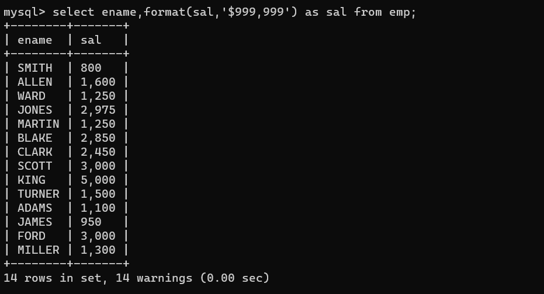


**str_to_date()：将字符串varchar类型转换成date类型**

**date_format：将date类型转换成具有一定格式的varchar字符串类型。**

```mysql
create table t_user(
	id int,
	name varchar(32),
	birth date #生日也可以使用date日期类型
);

create table t_user(
	id int,
    name varchar(32),
    birth char(10) #1990-10-11 生日可以使用字符串，没问题。
);
```


str_to_date函数可以将字符串转换成日期类型date

语法格式：str_to_date('字符串日期', '日期格式')

```mysql
/*
mysql的日期格式：
		%Y	年
		%m 月
		%d 日
		%h	时
		%i	分
		%s	秒
*/
```

```mysql
insert into t_user(id,name,birth) 
values(1,'zhangsan',str_to_date('01-10-1990','%d-%m-%Y'))

/*
	str_to_date函数可以把字符串varchar转换成日期date类型数据，
	通常使用在插入insert方面，因为插入的时候需要一个日期类型的数据，
	需要通过该函数将字符串转换成date。
	
	如果你提供的日期字符串是这个格式(%Y-%m-%d)，str_to_date函数就不需要了！！！
	insert into t_user(id,name,birth) values(2, 'lisi', '1990-10-01');
*/
```


date_format()函数可以将日期类型转换成特定格式的字符串。

date_format函数：date_format(日期类型数据, '日期格式')

这个函数通常使用在查询日期方面。设置展示的日期格式。

```mysql
select id,name,date_format(birth,'%m/%d/%Y') as birth from t_user;
```

```mysql
select id,name,birth from t_user;
/*
	以上的SQL语句实际上是进行了默认的日期格式化，
	自动将数据库中的date类型转换成varchar类型。
	并且采用的格式是mysql默认的日期格式：'%Y-%m-%d'
*/
```


- **date和datetime两个类型的区别**

date是短日期：只包括年月日信息。

datetime是长日期：包括年月日时分秒信息。

```mysql
drop table if exists t_user;
create table t_user(
	id int,
	name varchar(32),
	birth date,
	create_time datetime #长日期类型
);
```

mysql短日期默认格式：%Y-%m-%d

mysql长日期默认格式：%Y-%m-%d %h:%i:%s

```mysql
insert into 
t_user(id,name,birth,create_time) 
values(1,'zhangsan','1990-10-01','2020-03-18 15:49:50');
```


**使用now()可以获取系统当前时间**

```mysql
insert into t_user(id,name,birth,create_time) values(2,'lisi','1991-10-01',now());
```


- **修改update**

```mysql
#语法格式
update	
	表名
set 
	字段名1=值1，字段名2=值2，字段名3=值3...
where
	条件;
	
#注意：没有条件限制会导致所有数据全部更新
```


- **删除数据delete**

```mysql
#语法格式
delete from 表名 where 条件；

#注意：没有条件，整张表的数据会删除
```


- **insert语句一次插入多条记录**

```mysql
insert into t_user(id,name,birth,create_time) values
    (1,'zhangsan','1998-06-01',now()),
    (2,'lisi','2000-05-03',now()),
    (3,'xiaoming','2005-10-16',now());
```


- **快速创建表（了解）**

```mysql
create table emp2 as select * from emp;
```

原理：将一个查询结果当做一张表新建，可以快速完成表的复制，同时也能将表中的数据复制过来。


- **将查询结果插入到一张表中（了解）**

```mysql
insert into emp2 select * from emp;
```


- **快速删除表中的数据**

```mysql
delete from emp2;#这种方式删除数据比较慢
```

delete语句删除数据的原理：

表中的数据被删除了，但是数据在硬盘上的真实存储空间不会被释放。

缺点：删除效率比较低

优点：支持回滚，可以恢复数据


```mysql
truncate table 表名;#属于DDL操作
```

truncate语句删除数据的原理：

删除效率高，表被一次截断，物理删除

缺点：不支持回滚

优点：快速


- **删除表**

以上两种操作都是删除表中的数据，删除表可以使用如下语句

```mysql
drop table 表名;
```


## 2.对表结构的增删改

- 什么是对表结构的修改？

添加一个字段，删除一个字段，修改一个字段。

对表结构的修改需要使用：alter，属于DDL语句。

DDL包括：create drop alter


实际开发中，需求确定之后，表设计完成后，很少对表结构进行修改。因为开发过程中，修改表结构，成本比较高。修改表结构，对应的操作数据表的代码就要进行大量的修改。

修改表结构的操作少，且不需要掌握，如果真的需要修改表结构，可以使用工具。


# 4.约束※

## 1.概念

- **什么是约束？**

约束对应的英语单词：constraint

在创建表的时候，我们可以给表中的字段加上一些约束，来保证这个表中数据的完整性、有效性。

约束的作用就是为了保证：表中的数据有效。


- **约束包括哪些？**

  非空约束：not null

  唯一性约束: unique

  主键约束: primary key （简称PK）

  外键约束：foreign key（简称FK）

  检查约束：check（mysql不支持，oracle支持）


## 2.非空约束

非空约束not null约束的字段不能为NULL。

```mysql
drop table if exists t_vip;
create table t_vip(
	id int,
    name varchar(255) not null #not null只有列级约束，没有表级约束
);

insert into t_vip(id,name) values(1,'zhangsan');
insert into t_vip(id,name) values(2,'lisi');
```

补充：以.sql结尾的文件被称为sql脚本文件，sql脚本文件中编写了大量的sql语句。执行sql脚本文件的时候，该文件中所有的sql语句会全部执行。

如何在MySQL中执行sql脚本？

```mysql
source 文件路径
```


## 3.唯一性约束

- **唯一性约束unique约束的字段不能重复，但是可以为NULL**

```mysql
drop table if exists t_vip;
create table t_vip(
	id int,
	name varchar(255) unique,#唯一性约束
	email varchar(255)
);

insert into t_vip(id,name,email) values(1,'zhangsan1','zhangsan@123.com');
insert into t_vip(id,name,email) values(2,'lisi','lisi@123.com');
insert into t_vip(id,name,email) values(3,'wangwu','wangwu1@123.com');

#name字段有唯一性约束，不能插入重复的数据，会报错
insert into t_vip(id,name,email) values(4,'wangwu','wangwu@sina.com');

#具有唯一性约束的字段可以为NULL
insert into t_vip(id) values(4);
insert into t_vip(id) valuse(5);


```


- **使name和email两个字段联合起来具有唯一性**

```mysql
drop table if exists t_vip;
create table t_vip(
	id int,
    name varchar(255),
    email varchar(255),
    unique(name,email) #约束没有添加在列的后面，这种约束被称为表级约束
);

#name和email字段联合起来唯一
insert into t_vip(id,name,email) values(1,'zhangsan','zhangsan@123.com');
insert into t_vip(id,name,email) valuse(2,'zhangsan','zhangsan@sina.com');

#需要使多个字段联合起来具有唯一性时，使用表级约束
```


- **unique和not null可以联合使用**

```mysql
drop table if exists t_vip;
create table t_vip(
	id int,
    name varchar(255) not null unique
);

/*
	在mysql中，如果一个字段同时被not null和unique约束，该字段自动变为主键字段
	（oracle不一样）
*/
```


## 4.主键约束※

- **相关术语**

主键约束：就是一种约束。

主键字段：该字段上添加了主键约束，这样的字段叫做：主键字段

主键值：主键字段中的每一个值都叫做：主键值。


- **什么是主键？**

主键值是每一行记录的唯一标识。

主键值是每一行记录的身份证号

任何一张表都应该有主键，没有主键，表无效。

主键的特征：not null + unique（主键值不能是NULL，同时也不能重复！）


- 如何给一张表添加主键约束

```mysql
drop table if exists t_vip;
create table t_vip(
	id int primary key,#列级约束
    name varchar(255)
);
```

```mysql
drop table if exists t_vip;
create table t_vip(
	id int,
    name varchar(255), 
    primary key(id) #表级约束
);
```


- **表级约束主要是给多个字段联合起来添加约束**

```mysql
drop table if exists t_vip;
create table t_vip(
	id int,
    name varchar(255),
    primary key(id,name)
);
```

在实际开发中，不建议使用复合主键，建议使用单一主键，因为主键存在的意义就是这行记录的唯一性，只要意义达到即可，单一主键可以达到效果。


主键值建议使用：int、bigint、char等类型

不建议使用varchar做主键，主键值一般都是数字，都是定长的。


主键还可以分为：

自然主键：主键值是一个自然数，和业务没关系

业务主键：主键值和业务紧密关联，例如用银行卡账号做主键值，这就是业务主键

在实际开发中，自然主键使用的更多。因为主键只要做到不重复就行，不需要有意义。业务主键不好，因为主键一旦和业务挂钩，当业务发生变动时，可能会影响主键值，所以不建议使用业务主键。


- **在mysql中，有一种机制，可以帮助自动维护一个主键**

```mysql
drop table if exists t_vip;
create table t_vip(
	id int primary key auto_increment, #auto_increment表示自增，从1开始，以1递增
	name varchar(255)
);
```


## 5.外键约束※

- **相关术语**

外键约束：一种约束（foreign key）

外键字段：该字段上添加了外键约束

外键值：外键字段当中的每一个值。

```mysql
/*
业务背景：请设计数据库表，来描述“班级和学生”的信息

第一种方案：班级和学生存储在一张表中
no(pk)			name	 			classno				classname
-------------------------------------------------------------------
1				jack				100					高三一班			
2				lucy				100					高三一班
3				tom					100					高三一班
4				lilei				101					高三二班
5				lusi				101					高三二班
6				xiaoming			101					高三二班

分析以上方案的缺点：数据冗余，空间浪费。
*/

/*
第二种方案：班级一张表，学生一张表
t_class 班级表
classno(pk)				classname
-----------------------------------
100						高三一班
101						高三二班

t_student 学生表
no(pk)			name	 			classno				
---------------------------------------------
1				jack				100							
2				lucy				100					
3				tom					100					
4				lilei				101					
5				lusi				101					
6				xiaoming			101				

	当cno字段没有任何约束的时候，可能会导致数据无效。可能出现一个102，但是102班级不存在。
	所以为了保证cno字段中的值都是100和101，需要给cno字段添加外键约束。
	那么：cno字段就是外键字段。cno字段中的每一个值都是外键值。

*/

#先创建父表
create table t_class(
	classno int primary key,
    classname(255)
);

#再创建字表
create table t_student(
	no int primary key,
    name varchar(255),
    classno int,
    foreign key(classno) references t_class(classno)
);

#先向父表插入数据
insert into t_class(classno,classname) values(100,'高三一班');
insert into t_class(classno,classname) values(101,'高三二班');

#再向子表添加数据
insert into t_class(no,name,classno) values
(1,'jack',100),
(2,'lucy',100),
(3,'tom',100),
(4,'lilei',101),
(5,'lusi',101),
(6,'xiaoming',101);

```


