# 1.基本概念

## 1.概念

- **什么是数据库？什么是数据库管理系统？什么是SQL？他们之间的关系是什么？**

- **数据库**：英文单词DataBase，简称DB。按照一定格式存储数据的一些文件的组合。顾名思义：存储数据的仓库，实际上就是一堆文件。这些文件中存储了具有特定格式的数据。

- **数据库管理系统**：DataBaseManagement，简称DBMS。数据库管理系统是专门用来管理数据库中数据的，数据库管理系统可以对数据库当中的数据进行增删改查。

  常见的数据库管理系统：MySQL、Oracle、MS SqlServer、DB2、sybase等....

- **SQL：结构化查询语言**：程序员需要学习SQL语句，程序员通过编写SQL语句，然后DBMS负责执行SQL语句，最终来完成数据库中数据的增删改查操作。SQL是一套标准，程序员主要学习的就是SQL语句，这个SQL在mysql中可以使用，同时在Oracle中也可以使用，在DB2中也可以使用。

2.三者之间的关系？
DBMS--执行--> SQL --操作--> DB

先安装数据库管理系统MySQL，然后学习SQL语句怎么写，编写SQL语句之后，DBMS对SQL语句进行执行，最终来完成数据库的数据管理。


## 2.MySQL服务

- **看一下计算机上的服务，找一找MySQL的服务在哪里？**

计算机-->右键-->管理-->服务和应用程序-->服务-->找mysql服务。MySQL的服务，默认是“启动”的状态，只有	启动了mysql才能用。默认情况下是“自动”启动，自动启动表示下一次重启操作系统的时候，自动启动该服	务。

可以在服务上点击右键：
	启动
	重启服务
	停止服务
	...

还可以改变服务的默认配置：
	服务上点击右键，属性，然后可以选择启动方式：
	自动（延迟启动）
	自动
	手动
	禁用


- **在windows操作系统当中，怎么使用命令来启动和关闭mysql服务呢？**

语法：
	net stop 服务名称;
	net start 服务名称;

其它服务的启停都可以采用以上的命令。


- **mysql安装了，服务启动了，怎么使用客户端登录mysql数据库呢？**

- **显示登录密码的方式**

```
mysql -uroot -p123456
```

123456可以替换为自己的密码

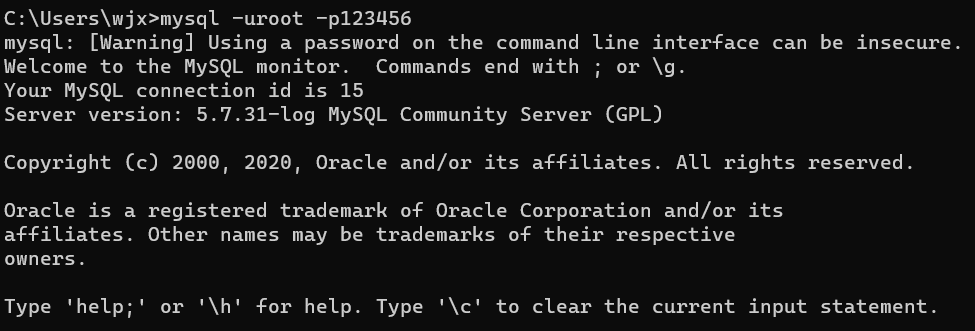

- **不显示登录密码的方式**

```
mysql -u root -p
```

执行命令后输入密码即可登录	

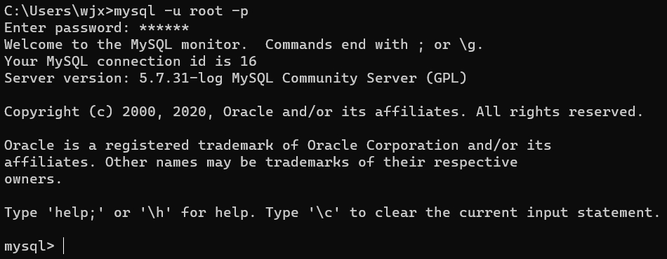

## 

## 3.mysql常用命令

- 退出mysql

```
exit
```

- 查看mysql中有哪些数据库

```
show databases；（注：以英文分号结尾）
```

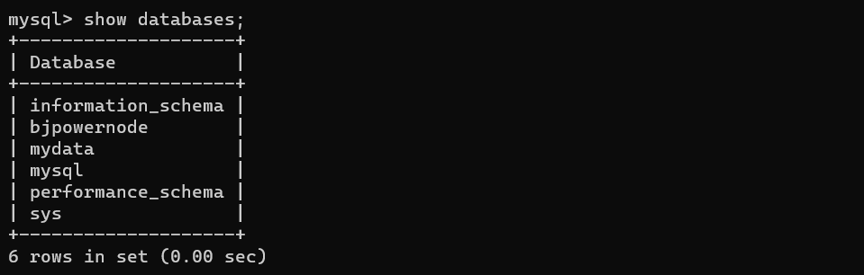

- 选择使用某个数据库

```
use 数据库名称
```

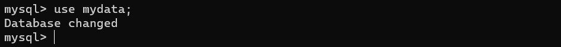

- 创建数据库

```
create database 数据库名称;
```

- 查看某个数据库下的表

  要查看某个数据库中的表，必须先使用该数据库。

```
show tables;
```

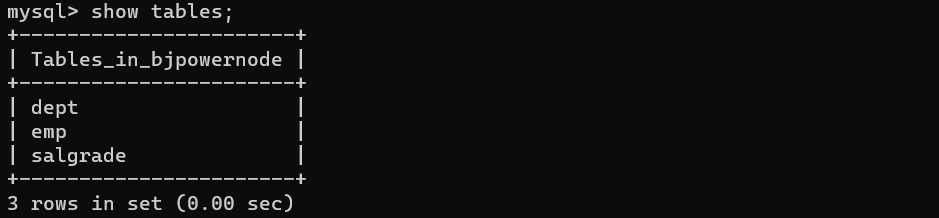

- 查看数据库的版本号

```
select version();
```

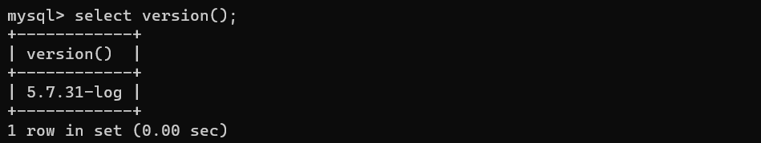

- 查看当前使用的是哪个数据库

```
select database();
```

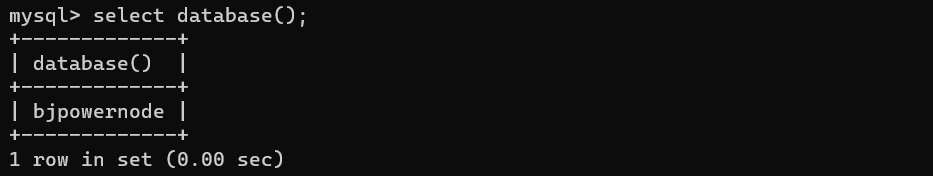

**注意**：mysql命令以英文“;”表示结束。只有输入分号之后命令才会执行。

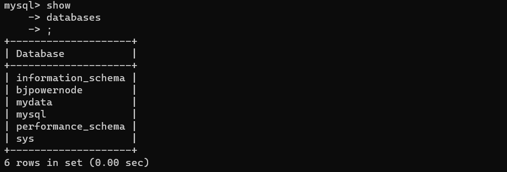

也可以使用“\c”来终止一条命令的输入。

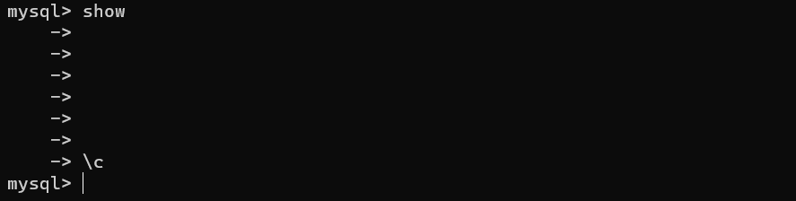


## 4.表

数据库当中最基本的单元是表：table

什么是表table？为什么用表来存储数据呢？

​		姓名		性别		年龄(列：字段) 
​		张三		男			20            ------->行（记录）
​		李四		女			21            ------->行（记录）
​		王五		男			22            ------->行（记录）

数据库当中是以表格的形式表示数据的。因为表比较直观。

任何一张表都有行和列：
		行（row）：被称为数据/记录。
		列（column）：被称为字段。

每一个字段都有：字段名、数据类型、约束等属性。

- [ ] 字段名可以理解，是一个普通的名字，见名知意就行。
- [ ] 数据类型：字符串，数字，日期等，后期讲。
- [ ] 约束：约束也有很多，其中一个叫做唯一性约束，这种约束添加之后，该字段中的数据不能重复。


## 5.SQL语句的分类

SQL语句有很多，最好进行分门别类，这样更容易记忆。

- **DQL：数据查询语言**（凡是带有select关键字的都是查询语句）
  				select...

- **DML：数据操作语言**（凡是对表当中的数据进行增删改的都是DML）
  		insert delete update
    		insert 增
    		delete 删
    		update 改

​		这个主要是操作表中的数据data。

- **DDL：数据定义语言** （凡是带有create、drop、alter的都是DDL）。DDL主要操作的是表的结构。不是表中的数据。
  		create：新建，等同于增
    		drop：删除
    		alter：修改
    		这个增删改和DML不同，这个主要是对表结构进行操作。

- **TCL：事务控制语言**
  		包括：
    		事务提交：commit;
    		事务回滚：rollback;

- **DCL：数据控制语言。**
  		例如：授权grant、撤销权限revoke....


## **6.导入数据**

- **导入一下提前准备好的数据**

bjpowernode.sql文件是用来后续练习使用的数据库表。

- 导数sql文件中的数据

```mysql
source 文件路径
```

注意路径中不要出现中文！！！


# 2.DQL语句


## 1.查看表中数据和结构

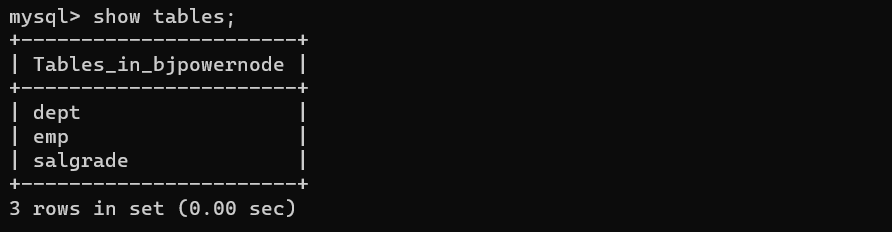

dept是部门表
emp是员工表
salgrade 是工资等级表

- 查看表中的数据

```mysql
select * from 表名；
```


- 查看表的结构

```mysql
desc 表名；
```

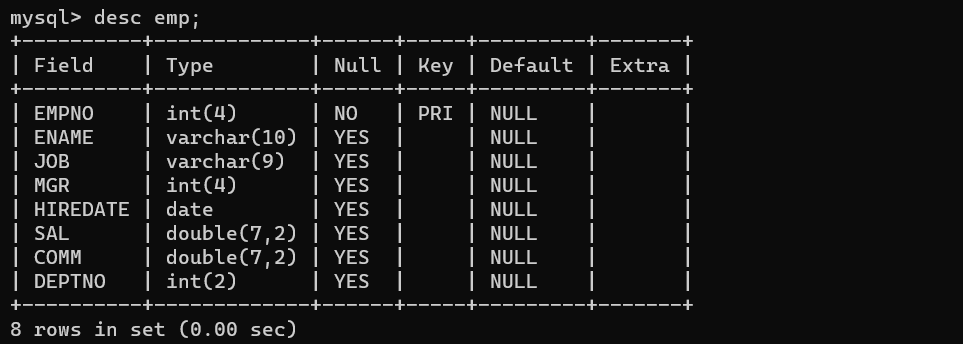

EMPNO：员工编号	ENAME：员工姓名	JOB：工作岗位	MRG：上级编号

HIREDATE：入职日期	SAL：工资	COMM：补助	DEPTNO：部门编号

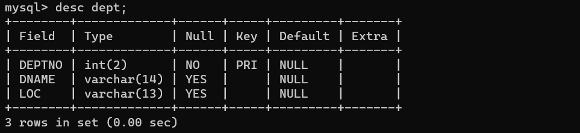

DEPTNO：部门编号	DNAME：部门名称	LOC：地理位置

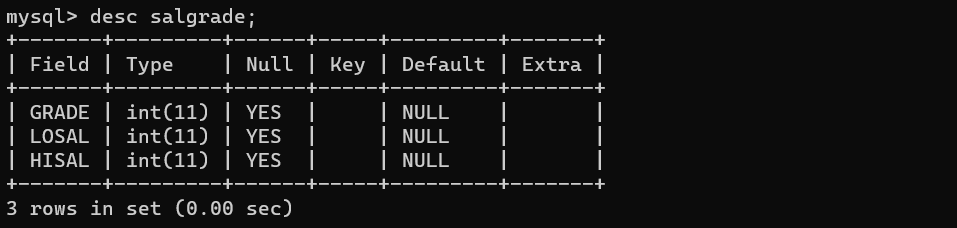

GRADE：工资等级	LOSAL：最低工资	HISAL：最高工资


## 2.简单查询

- 查询一个字段

```mysql
select 字段名 from 表名；
```

select和from都是关键字。字段名和表名都是标识符。

注意：所有的SQL语句都以“;”结尾，SQL语句不区分大小写。

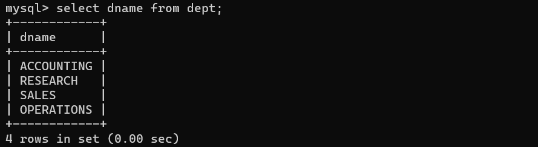

- 查询两个字段

```mysql
select 字段名,字段名 from 表名；
```

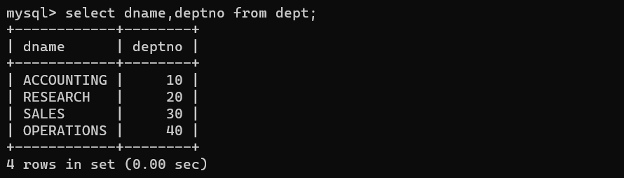

- 查询所有字段

把所有字段名都写上，也可以使用“*”

```mysql
select * from 表名;
```

这种方式的缺点：效率低，可读性差，在实际开发中不建议，可以自己玩没问题。可以在DOS命令窗口中想快速的看一看全表数据可以采用这种方式。

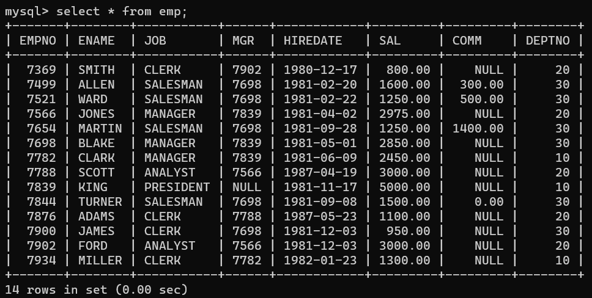

- 给查询的列起别名

```mysql
select 字段名 as 别名 from 表名；
```

使用as关键字起别名。只是将显示的查询结果列名显示为deptname，原表列名还是叫：dname
记住：select语句是永远都不会进行修改操作的。（因为只负责查询）。as关键字可以省略。

- 别名里面有空格

```mysql
select 字段名 as '别 名' from 表名;
```

当别名里面有空格时，使用单引号将别名引起来。注意：在所有的数据库当中，字符串统一使用单引号括起来，单引号是标准，双引号在oracle数据库中用不了。但是在mysql中可以使用。

- 计算员工年薪

```mysql
select ename,sal*12 as yearsal from emp;
```

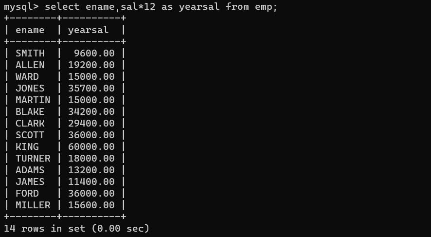

```mysql
select ename,sal*12 as '年薪' from emp;
```

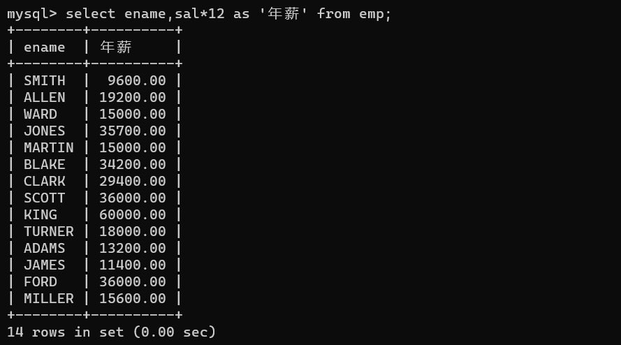


## 3.条件查询

（1）什么是条件查询？不是将表中所有的数据都查出来，只查询出来符合条件的。

```mysql
select 
	字段1,字段2,字段3...
from 
	表名
where
	条件;
```

（2）都有哪些条件？

- **等于	=**

*查询薪资等于800的员工姓名和编号*

```mysql
select ename,empno,sal from emp where sal=800;
```

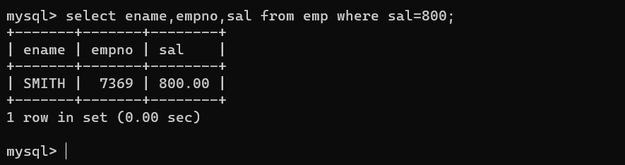

- **不等于	<>或!=**
- **小于	<**

*查询薪资小于2000的员工信息*

```mysql
select empno,ename,sal from emp where sal<2000;
```

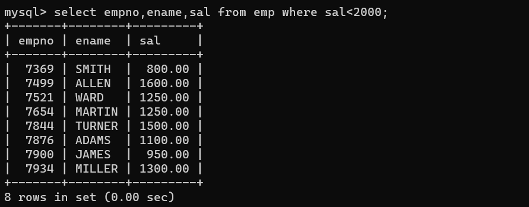

- **小于等于 	<=**

- **大于        >**

- **大于等于        >=**

  

- **between...and... 两个值之间，等同于>= and <=**         

*查询薪资在2450和3000之间的员工信息，包括2450和3000*

```mysql
select empno,ename,sal from emp where sal>= 2450 and sal<=3000;
```

and是并且的意思

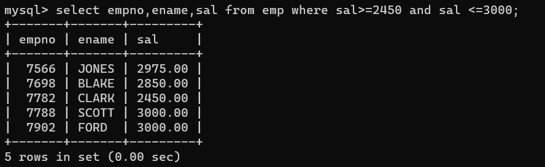

```mysql
select 
	empno,ename,sal
from
	emp
where
	sal between 2450 and 3000;
```

注意：使用between and的时候，必须遵循左小右大。between and是闭区间，包括两端的值。


- **is null / is not null**

*查询哪些员工的补助为null*

```mysql
select empno,enam,sal,comm from emp where comm is null;
```

注意：在数据库当中null不能使用等号进行衡量。需要使用is null。因为数据库中的null代表什么也没有，它不是一个值，所以不能使用等号衡量。

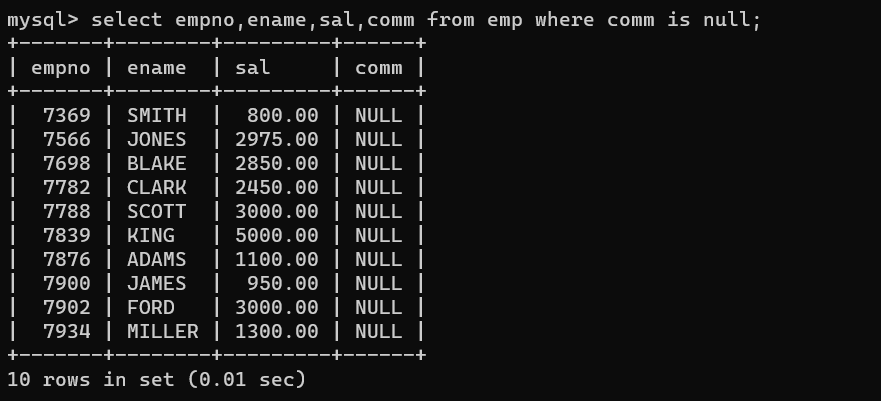


- 并且	and


*查询工作岗位是MANAGER并且工资大于2500的员工信息*

```mysql
 select empno,ename,sal,job from emp where job='MANAGER' and sal>2500;
```

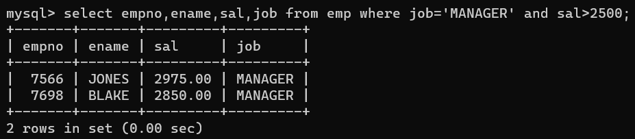


- 或者	or

*查询工作岗位是MANAGER和SALESMAN的员工*

```mysql
select empno,ename,sal,job from emp where job='MANAGER' or job='SALESMAN';
```

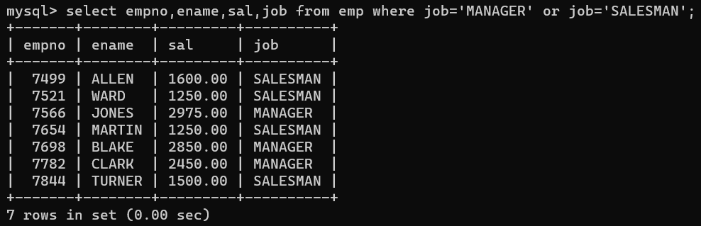


注意：and和or同时出现，and优先级较高。如果想让or先执行，需要加“小括号”。以后在开发中，如果不确定优先级，就加小括号就行了。

*查询工资大于2500，并且部门编号为10或20部门的员工*

```mysql
select empno,ename,sal,deptno from emp where sal>2500 and (deptno=10 or deptno =20);
```

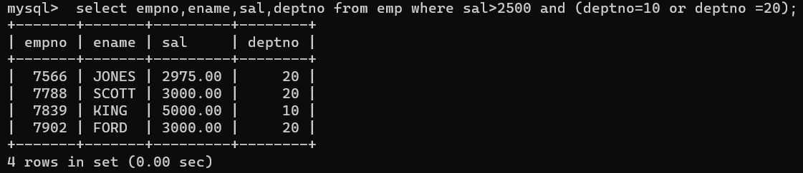


- **包含	in	相当于多个or****

*查询工作岗位是MANAGER和SALESMAN的员工*

```mysql
select empno,ename,sal,job from emp where job='MANAGER' or job='SALESMAN';
select empno,ename,job from emp where job in ('MANAGER','SALESMAN');
```


- **not 可以用来取非，主要用在is 和 in中**

- [ ] is null
- [ ] is not null
- [ ] in
- [ ] not in


- **like 模糊查询**

支持%或下划线匹配。

%匹配任意多个字符。

下划线：任意一个字符。

*找出名字中含有O的*

```mysql
select empno,ename from emp where ename like '%o%';
```

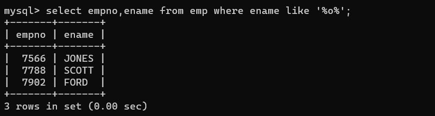

*找出名字以T结尾的*

```mysql
select ename from emp where ename like '%T';
```

*找出第二个字母是A的*

```mysql
select ename from emp where ename like '_A%';
```

*找出第三个字母是R的*

```mysql
select ename from emp where ename like '__R';
```

注意：如过要找的字符中含有“%”和“_”，需要使用转义字符“\”

*找出名字中有_的*

```mysql
select ename from emp where ename like '%\_';
```


## 4.排序

- **按单个字段升序**

*查询所有员工薪资，排序*

```mysql
select ename from emp order by sal;
```

注意：默认排序为升序，也可使用asc指定升序排序。

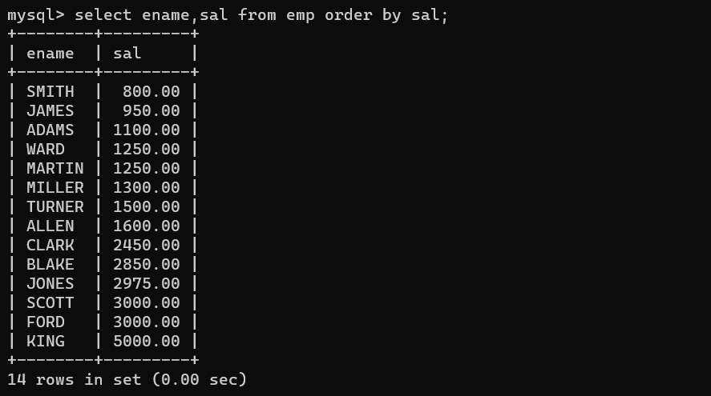


- **按单个字段降序**

*查询所有员工薪资，排序*

```mysql
select ename,sal from emp order by sal desc;
```

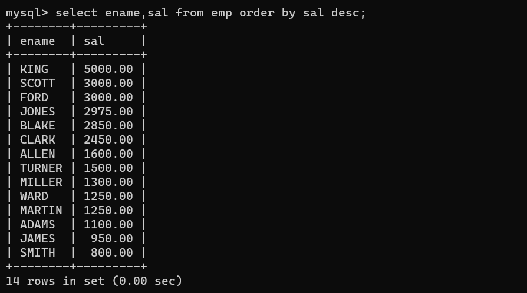


- 按多个字段排序

*查询员工名字和薪资，要求按照薪资升序，如果薪资一样的话，再按照名字升序排列。*

```mysql
select ename,sal from emp order by sal asc,ename asc;
```

注意：sal在前，起主导，只有sal相等的时候，才会考虑启用ename排序。

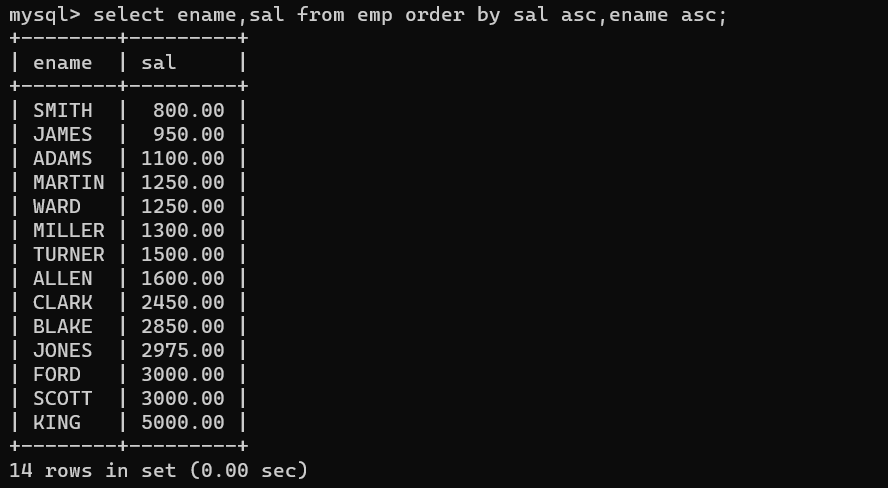


- **综合小案例**

*找出工资在1250到3000之间的员工信息，要求按照薪资降序排列。*

```mysql
select 
	ename,sal 
from 
	emp 
where 
	sal between 1250 and 3000 
order by 
	sal desc;
```

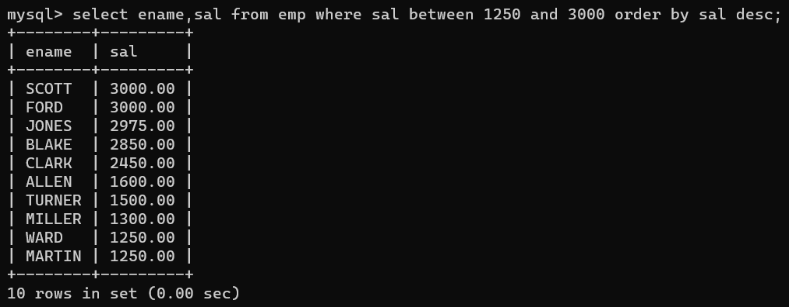


- **关键字顺序不能变**

```mysql
select
	...
from
	...
where
	...
order by
	...
```

注意：以上语句的执行顺序必须掌握：
	第一步：from
	第二步：where
	第三步：select
	第四步：order by（排序总是在最后执行！）


## 5.数据处理函数

单行处理函数的特点：一个输入对应一个输出。

和单行处理函数相对的是：多行处理函数。（多行处理函数特点：多个输入，对应1个输出！）

常见的单行处理函数：

- **lower	转换小写**

```mysql
select lower(ename) from emp;
```

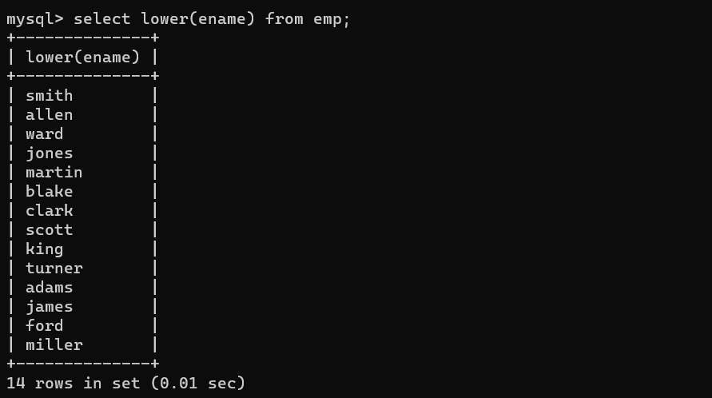

- **upper	转换大写**
- **substr        取字串**

substr(被截取的字符串，起始下标，截取的长度)

起始下标从1开始，没有0

```mysql
select substr(ename,1,1) from emp;
```

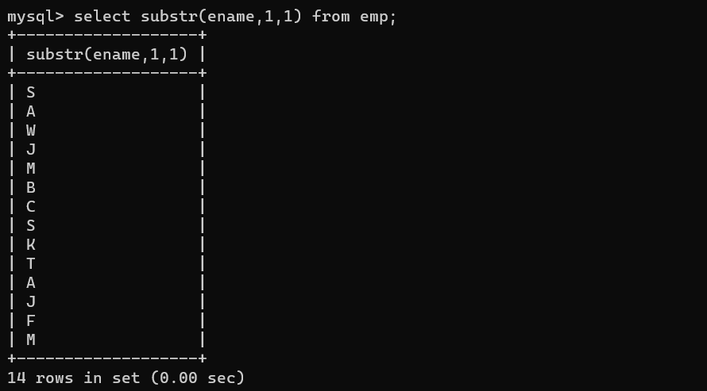


*找出员工名字第一个字母是A的员工信息*

```mysql
//方式一：模糊查询
select ename from emp where ename like 'A%';
//方式二：substr()
select ename from emp where substr(ename,1,1)='A';
```

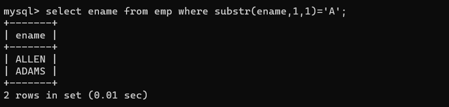


*查询员工的姓名，并将首字母大写*

```mysql
select
	concat(substr(ename,1,1),lower(substr(ename,2,length(ename) - 1))) 
as 
	result
from 
	emp;
```

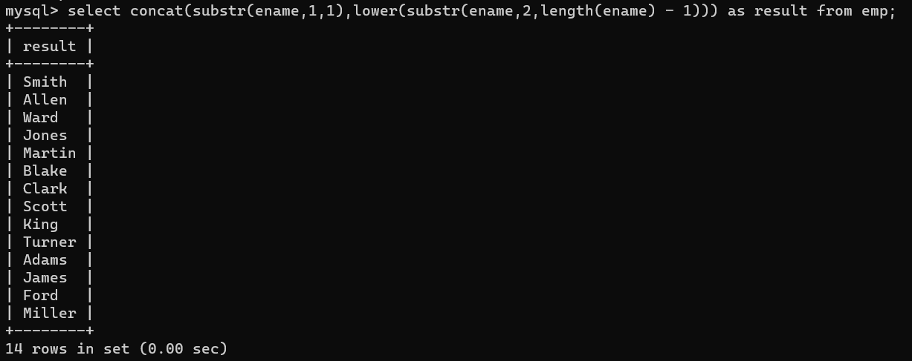


- **concat	字符串拼接函数**

```mysql
select concat(empno,ename) from emp;
```

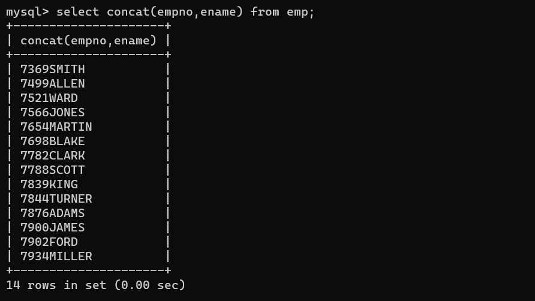


- **length	取长度**

```mysql
select length(ename) from emp;
```

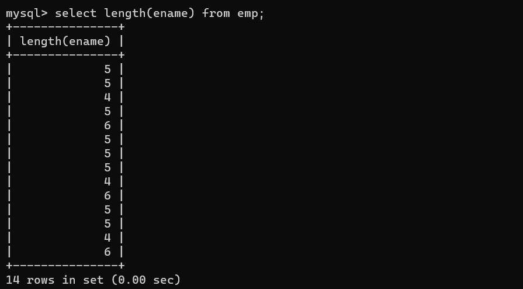


- **trim	去空格**

```mysql
select ename from emp where ename = trim('   KING');
```

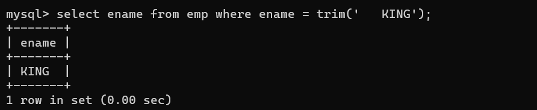


- **case..when..then..when..then..else..end**

*当员工的工作岗位是MANAGER的时候，工资上调10%，当工作岗位是SALESMAN的时候，工资上调50%,其它正常。（注意：不修改数据库，只是将查询结果显示为工资上调）*

```mysql
select 
	ename,job,sal as oldsal,
	(case job when 'MANAGER' then sal*1.1
			  when 'SALESMAN' then sal*1.5
			  else sal
			  end) as newsal
from 
	emp;
```

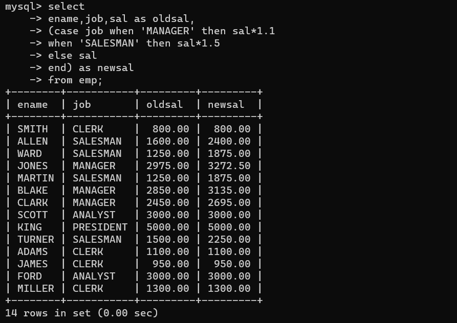


- round	四舍五入

```mysql
select 'abc' from emp;
```

select后直接跟字面量

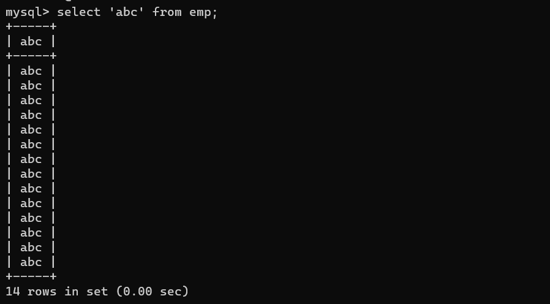


*保留整数位*

```mysql
select round(1236.567,0) as result from emp;
```

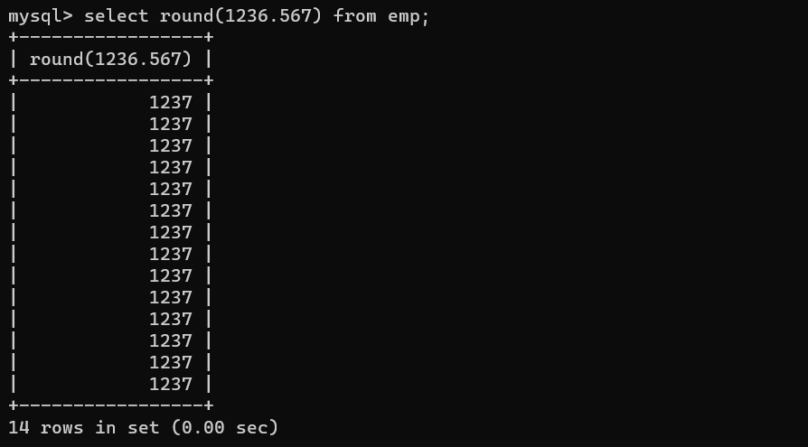

*保留一位小数*

```mysql
select round(1236.567,1) from emp;
```

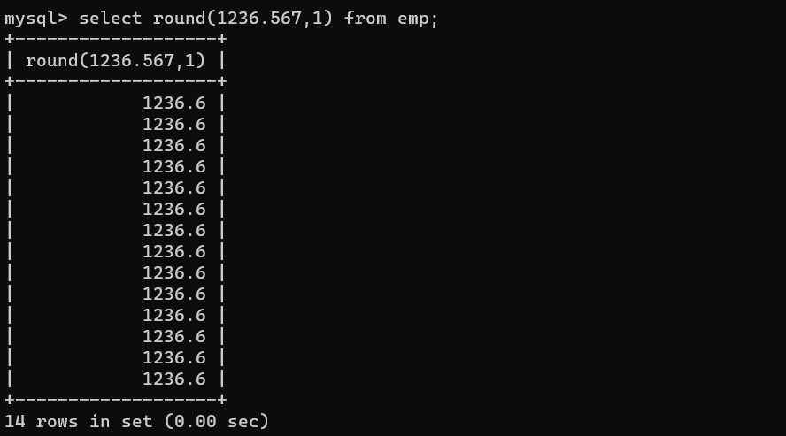

*保留到十位*

```mysql
select round(1236.567,-1) as result from emp;
```


- **rand()	生成随机数**

```mysql
select rand() from emp;
```

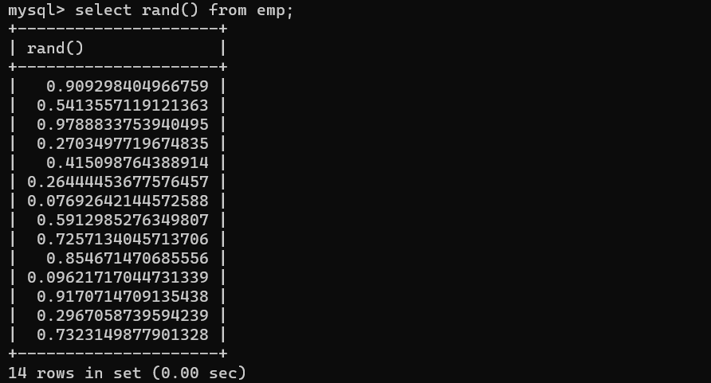


- **ifnull	空处理函数**

ifnull是空处理函数。专门处理空的。在所有数据库当中，只要有NULL参与的数学运算，最终结果就是NULL。

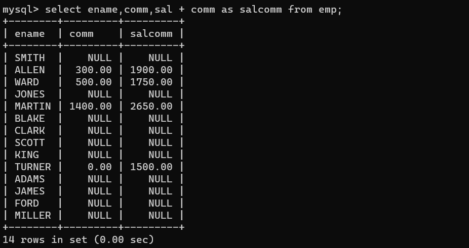

因为comm字段中有的值为NULL，参与运算之后，最终的结果为NULL。为了避免这个现象，需要使用ifnull函数。

ifnull(数据，被当做哪个值)

*计算每个员工的年薪	年薪 = (月薪 + 月补助)  × 12*

```mysql
select ename,(sal + ifnull(comm,0)) * 12 as yearsal from emp;
```

补助comm为NULL时，将补助当做0。

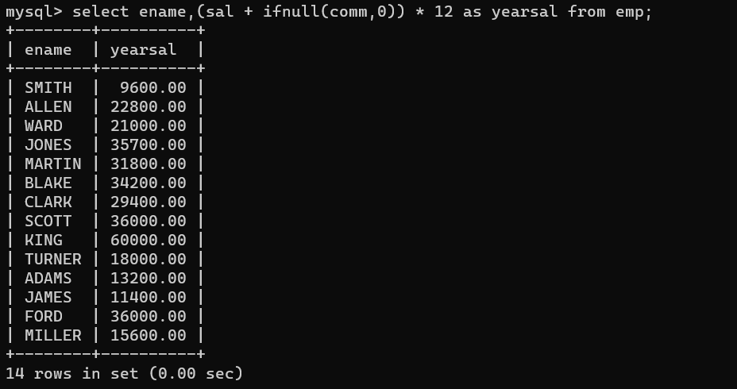


## 6.分组函数

分组函数又称多行处理函数，多行处理函数的特点是：输入多行，最终输出一行。

​	count()	计数

​	sum()	求和

​	avg()	求平均值

​	max()	最大值

​	min()	最小值


*找出最高工资*

```mysql
select max(sal) from emp;
```

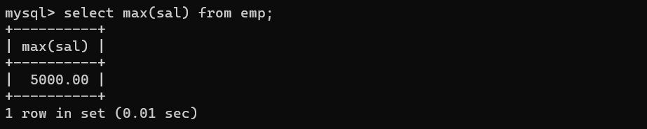

*找出最低工资*

```mysql
select min(sal) from emp;
```

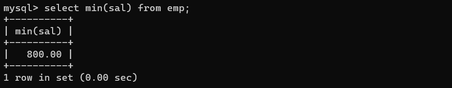

*计算工资和*

```mysql
select sum(sal) from emp;
```

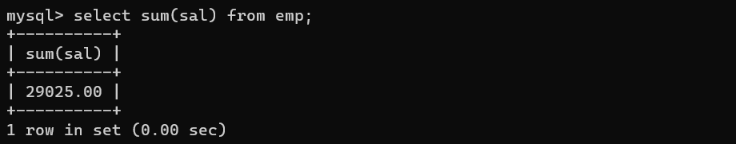

*计算平均工资*

```mysql
select avg(sal) from emp;
```

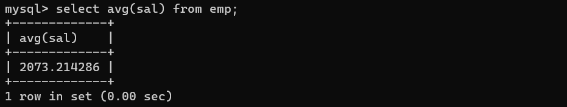

*计算员工数量*

```mysql
select count(ename) from emp;
```

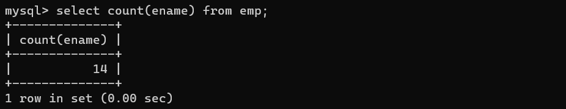


注意：

①分组函数在使用的时候必须先进行分组，然后才能使用。如果没有对数据进行分组，整张表默认为一组。

②分组函数自动忽略NULL，不需要对NULL进行处理，比如使用sum()求和时，不用专门针对NULL进行任何处理

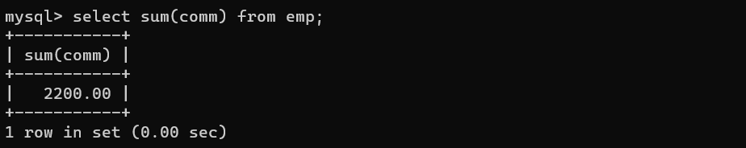

③分组函数中count(*)和count(具体字段)的区别。

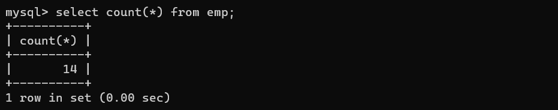

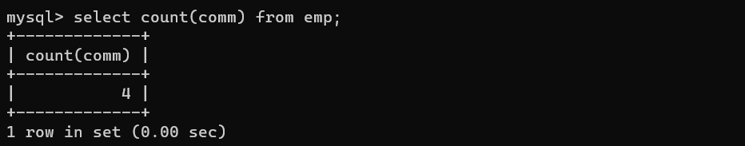

count(具体字段)：表示统计该字段下所有不为NULL的元素的总数。

count(*)：统计表当中的总行数。（只要有一行数据count则++）因为每一行记录不可能都为NULL，一行数据中有一列不为NULL，则这行数据就是有效的。

④分组函数不能够直接使用在where子句中，在分组查询group by解释。

⑤所有的分组函数可以组合起来一起用。

```mysql
select max(sal),min(sal),sum(sal),avg(sal),count(*) from emp;
```


## 7.分组查询※

- **什么是分组查询？**

在实际的应用中，可能有这样的需求，需要先进行分组，然后对每一组的数据进行操作。这个时候我们需要使用分组查询，怎么进行分组查询呢？
			

```mysql
select
	...
from
	...
group by
	...
```

例如：

计算每个部门的工资和？	计算每个工作岗位的平均薪资？	找出每个工作岗位的最高薪资？	....


- **关键字的执行顺序**

```mysql
select
	...
from
	...
where
	...
group by
	...
having
	...
order by
	...
```

关键字的顺序不能颠倒。

执行顺序为：

from	→	where	→	group by	→	having	→	select	→	order by


- **为什么分组函数不能直接使用在where后面？**

select ename,sal from emp where sal > min(sal);//报错。

因为分组函数在使用的时候必须先分组之后才能使用。where执行的时候，还没有分组。所以where后面不能出现分组函数。

select sum(sal) from emp; 

这个没有分组，为啥sum()函数可以用呢？因为select在group by之后执行。


- ***找出每个工作岗位的工资和***

```mysql
select job,sum(sal) from emp group by job
```

以上这个语句的执行顺序：先从emp表中查询数据；根据job字段进行分组；然后对每一组的数据进行sum(sal)

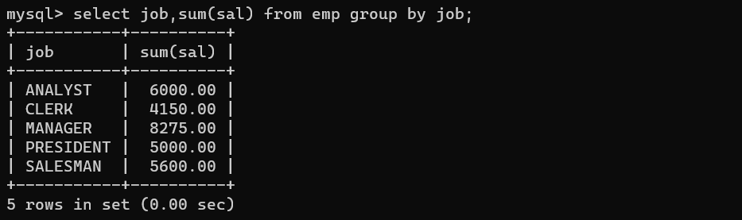

**在一条select语句当中，如果有group by语句的话，select后面只能跟：参加分组的字段，以及分组函数。其它的一律不能跟。**


- ***找出每个部门的最高薪资***

```mysql
select deptno,max(sal) from emp group by deptno;
```

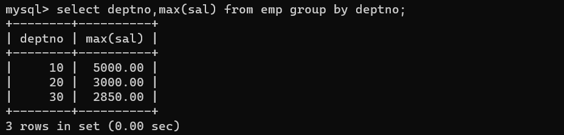


- ***找出“每个部门，不同工作岗位”的最高薪资***

```mysql
select deptno,job,max(sal) from emp group by deptno,job;
```

两个字段联合分组

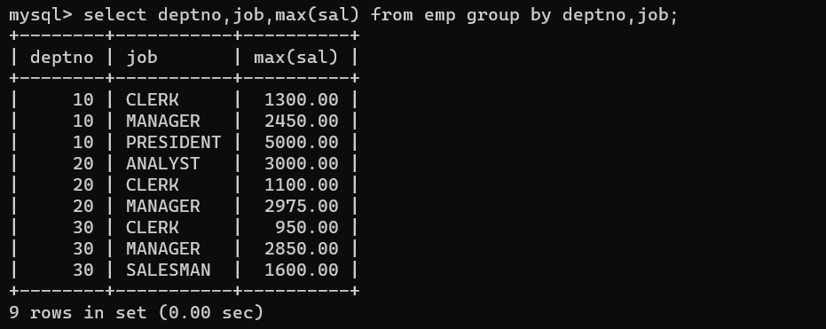


- ***使用having可以对分完组之后的数据进一步过滤***

having不能单独使用，having不能代替where，having必须和group by联合使用。


- ***找出每个部门最高薪资，要求显示最高薪资大于3000的***

```mysql
select deptno,max(sal) from emp group by deptno having max(sal) > 3000;
```

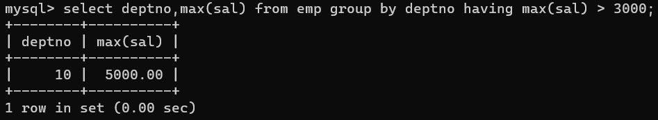

思考一个问题：以上的sql语句执行效率是不是低？

比较低，实际上可以这样考虑：先将大于3000的都找出来，然后再分组。

```mysql
select deptno,max(sal) from emp where sal > 3000 group by deptno;
```

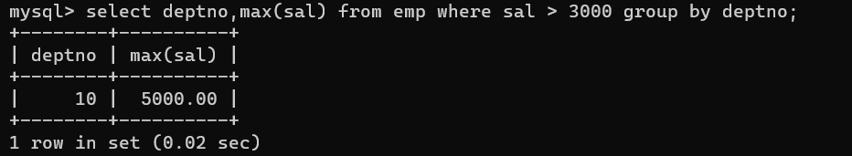

where和having，优先选择where，where实在完成不了了，再选择having。


- **找出每个岗位的平均薪资，要求显示平均薪资大于1500的，除MANAGER岗位之外，要求按照平均薪资降序排**

```mysql
select
	job,avg(sal) as avgsal
from 
	emp
where
	job <> 'MANAGER'
group by
	job
ordre by
	avgsal desc;
```

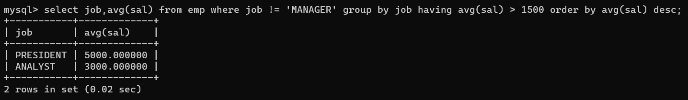


- ***distinct	把查询结果去除重复记录***

注意：原表数据不会修改，只是查询结果去重。

distinct只能出现在所有字段的最前方

```mysql
select distinct job from emp;
```

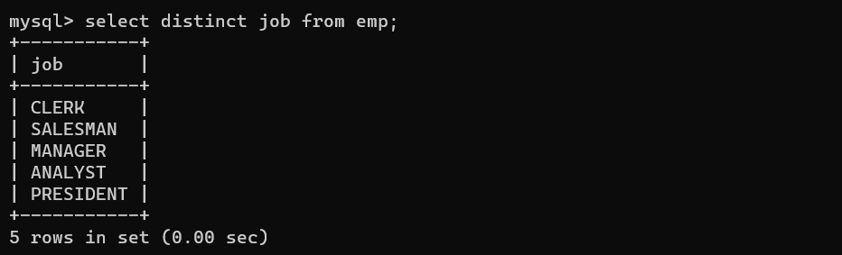

```mysql
select distinct job,deptno from emp;
```

distinct出现在两个字段之前，表示两个字段联合起来去重。

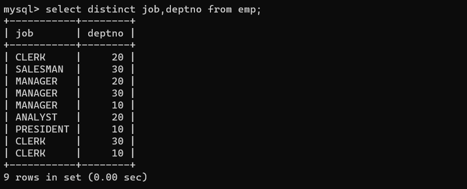


*统计岗位数量*

```mysql
select count(distinct job) from emp;
```

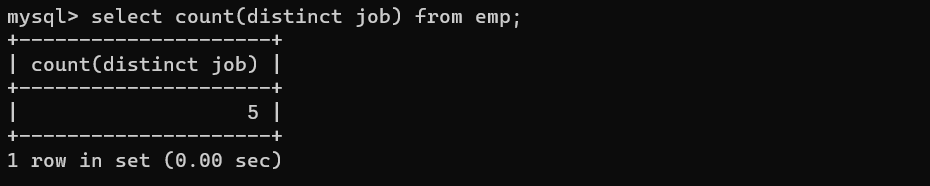


## 8.连接查询

- **什么是连接查询？**

从一张表中单独查询，称为**单表查询**。emp表和dept表联合起来查询数据，从emp表中取员工名字，从dept表中取部门名字。这种跨表查询，多张表联合起来查询数据，被称为**连接查询**。


- **连接查询的分类**

**根据语法的年代分类：**

SQL92：1992年的时候出现的语法

SQL99：1999年的时候出现的语法

我们这里重点学习SQL99.(这个过程中简单演示一个SQL92的例子)
	

**根据表连接的方式分类：**

内连接：等值连接，非等值连接，自连接

外连接：左外连接（左连接），右外连接（右连接），全连接（不讲）


- **当两张表进行连接查询时，没有任何条件的限制会发生什么现象？**

*查询每个员工所在部门名称*

```mysql
select ename,dname from emp,dept;
```

两张表连接没有任何条件限制

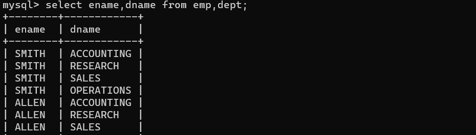

当两张表进行连接查询，没有任何条件限制的时候，最终查询结果条数，是两张表条数的乘积，这种现象被称为：笛卡尔积现象。（笛卡尔发现的，这是一个数学现象。）


- **如何避免笛卡尔积现象？**

连接查询时加条件限制，满足这个条件的记录会被筛选出来。

*查询每个员工所在部门名称*

```mysql
#方式一
select
	ename,dname
from 
	emp,dept
where
	emp.deptno = dept.deptno;
```

```mysql
#方式二
select
	emp.ename,dept.dname
from
	emp,dept
where
	emp.deptno = dept.deptno;
/*
	给表起别名很重要，涉及到效率问题。有别名后，如上例所示，ename会直接在emp表中找，
	不会再去dept表中找，dname也是同样的道理，从而提高了查询效率。
*/
```

```mysql
#方式三
#SQL92语法
select 
	e.ename,d,dname
from 
	emp e,dept d
where
	e.deptno = d.deptno;
```

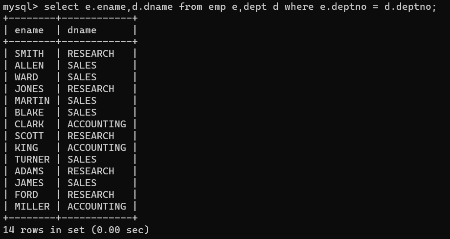

思考：最终查询的结果条数是14条，但是匹配的过程中，匹配的次数减少了吗？还是56次，只不过进行了四选一。次数没有减少。

注意：通过笛卡尔积现象得出，表的连接次数越多效率越低，尽量避免表的连接次数。


- **内连接之等值连接**

*查询每个员工所在部门名称，显示员工名和部门名*

思路：emp e和dept d表进行连接。条件是：e.deptno = d.deptno

```mysql
#SQL92语法
select
	e.ename,d.dname
from 
	emp e,dept d
where
	e.deptno = d.deptno;
/*
	sql92的缺点：结构不清晰，表的连接条件，和后期进一步筛选的条件，都放到了where后面。
*/
```

```mysql
#SQL99语法
select
	e.ename,d.dname
from
	emp e
inner join #inner可以省略，带着可读性好
	dept d
on
	e.deptno = d.deptno; #条件是等量关系，所以称为等值连接。
/*
	sql99优点：表连接的条件是独立的，连接之后，如果还需要进一步筛选，再往后继续添加where
*/
```


- **SQL99语法**

```mysql

select 
	...
from
	a
join
	b
on
	a和b的连接条件
where
	筛选条件
```


- **内连接之非等值连接**

*找出每个员工的薪资等级，要求显示员工名、薪资、薪资等级。*

```mysql
select 
	e.ename,e.sal,s.grade
from 
	emp e
join
	salgrade s
on
	e.sal between s.losal and s.hisal;#条件不是一个等量关系，称为非等值连接
```

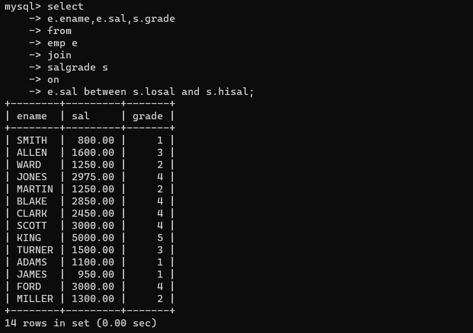


- **内连接之自连接**

*查询员工的上级领导，要求显示员工名和对应领导名*

思路：将一张表看做两张表

```mysql
select 
	a.ename,b.ename
from
	emp a
join
	emp b
on
	a.mgr = b.empno; #员工的领导编号=领导的员工编号
```

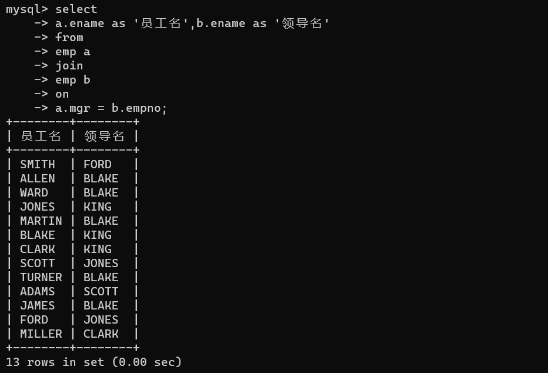

注意：查询结果只有13条记录，KING没有上级领导，所以没有显示。

```mysql
#内连接：A和B两张表没有主次关系，平等的。
select
	a.xxx,b.xxx
from 
	... a
join
	... b
on
	a.xxx = b.xxx #内连接的特点，完全能够匹配上这个条件的数据查询出来
```


- **外连接（右外连接）**

```mysql
select
	e.ename,d.dname
from
	emp e
right outer join #outer可以省略，带着可读性强
	dept d
on
	e.deptno = d.deptno;
/*
	right代表什么：表示将join关键字右边的这张表看成主表，主要是为了将
	这张表的数据全部查询出来，捎带着关联查询左边的表。
	在外连接当中，两张表连接，产生了主次关系。
*/
```


- **外连接（左外连接）**

```mysql
select
	e.ename,d.dname
from
	dept d
left join
	emp e
on e.deptno = d.deptno;
/*
	带有right的是右外连接，又叫做右连接。
	带有left的是左外连接，又叫做左连接。
	任何一个右连接都有左连接的写法。
	任何一个左连接都有右连接的写法。
	外连接的查询结果条数一定是 >= 内连接的查询结果条数
*/
```

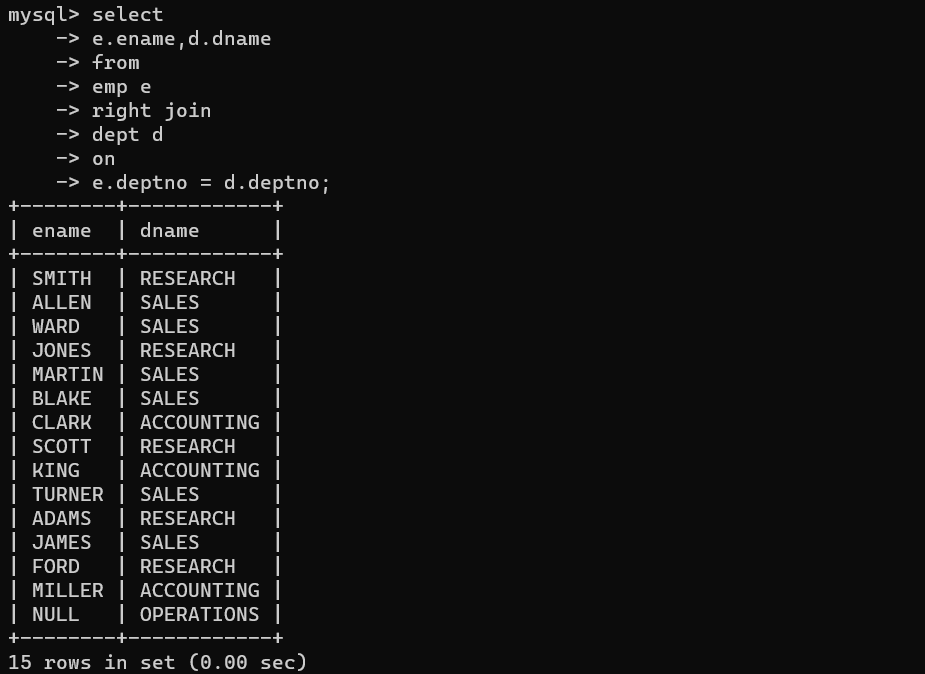


*查询每个员工的上级领导，要求显示所有员工的名字和领导名*

```mysql
select
	a.ename as '员工名',b.ename as '领导名'
from
	emp a
left join
	emp b
on
	a.mgr = b.empno;
```

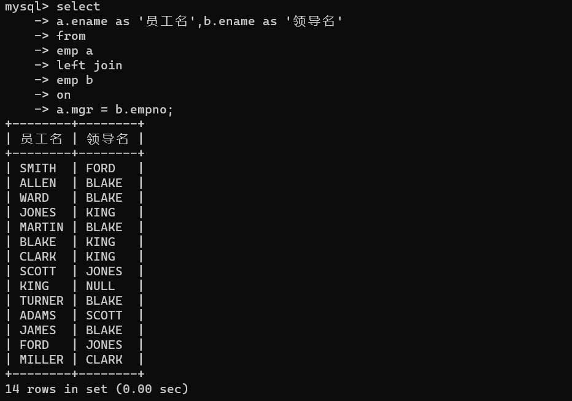


- **多张表连接查询**

```mysql
#语法：
select 
	...
from
	a
join
	b
on
	a和b的连接条件
join
	c
on
	a和c的连接条件
right join
	d
on
	a和d的连接条件

#一条SQL中内连接和外连接可以混合。都可以出现！
```


*找出每个员工的部门名称以及工资等级，要求显示员工名、部门名、薪资、薪资等级*

```mysql
select 
	e.ename,d.dname,e.sal,s.grade
from
	emp e
join
	dept d
on
	e.deptno = d.deptno
join
	salgrade s
on
	e.sal between s.losal and s.hisal;
```

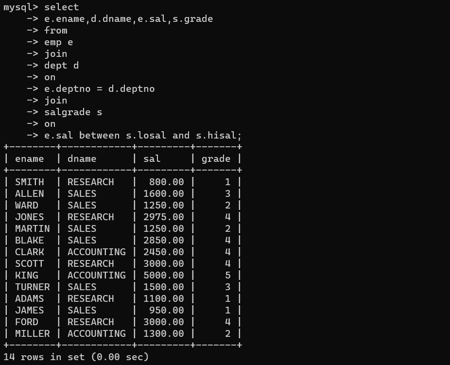


*找出每个员工的部门名称、工资等级以及上级领导，要求显示员工名、领导名、部门名、薪资、薪资等级*

```mysql
select
	a.ename as '员工名',b.ename as '领导名',d.dname,a.sal,s.grade
from
	emp a
left join
	emp b
on
	a.mgr = b.empno;
join
	dept d
on
	a.deptno = d.deptno
join
	salgrade s
on
	a.sal between s.lowsal and s.hisal;
```

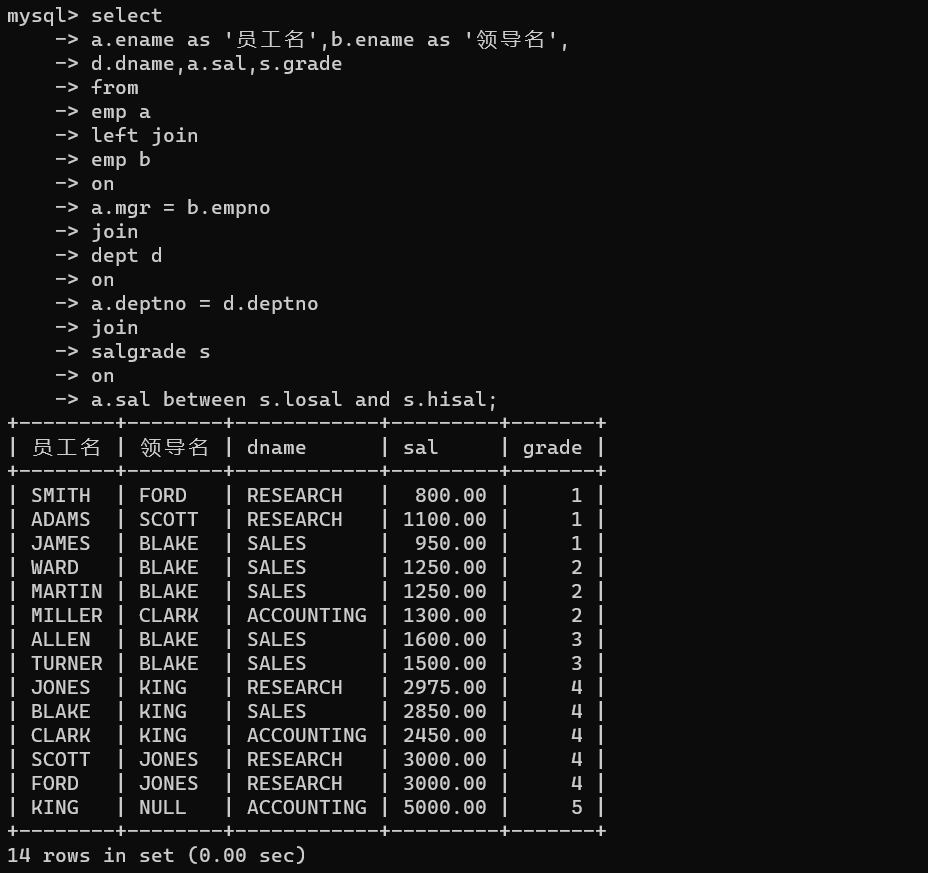


## 9.子查询

- **什么是子查询？**

select语句中嵌套select语句，被嵌套的select语句称为子查询。


- **子查询出现的位置**

```mysql
select
	..(select).
from
	..(select).
where
	..(select).
```


- **where子句中的子查询**

*找出比最低工资高的员工姓名和工资*

实现思路：

第一步：查询最低工资是多少

```mysql
select min(sal) from emp;
```

第二步：找出工资>800的

```mysql
select ename,sal from emp where sal > 800;
```

第三步：合并

```mysql
select ename,sal from emp where sal > (select min(sal) from emp);
```

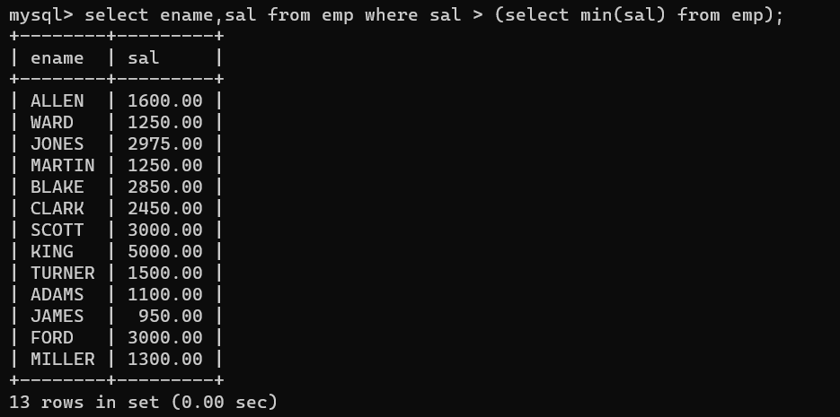


- **from子句中的子查询**

注意：from后面的子查询，可以将子查询的查询结果当做一张临时表。（技巧）

*找出每个岗位的平均工资的薪资等级*

第一步：找出每个岗位的平均工资

```mysql
select job,avg(sal) from emp order by job;
```

第二步：把第一步的查询结果当做一张真实存在的表t，用表t和薪资等级表s进行连接

```mysql
select 
	t.*,s.grade
from
	(select job,avg(sal) as avgsal from emp group by job) t
join
	salgrade s
on
	t.avgsal between s.losal and s.hisal;
```


- **select后面的子查询**（了解）

*找出每个员工的部门名称，要求显示员工名，部门名*

```mysql
select
	e.ename,e.deptno,(select d.dname from dept d where e.deptno = d.deptno) as dname
from 
	emp e;
```

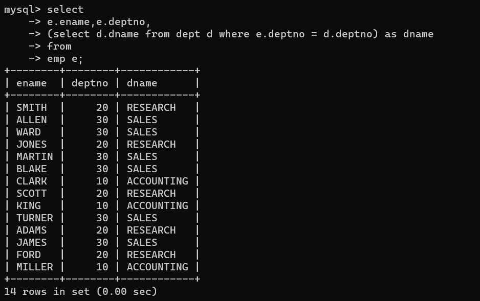

注意：对于select后面的子查询来说，这个子查询只能一次返回1条结果，多于1条，就报错！


## 10.union

union用来合并查询结果集

*查询工作岗位是MANAGER和SALESMAN的员工*

```mysql
select ename,job from emp where job = 'MANAGER' or job = 'SALESMAN';
```

```mysql
select ename,job from emp where job in('MANAGER','SALESMAN');
```

```mysql
select ename job from emp where job = 'MANAGER'
union
select ename job from emp where job = 'SALESMAN';
```

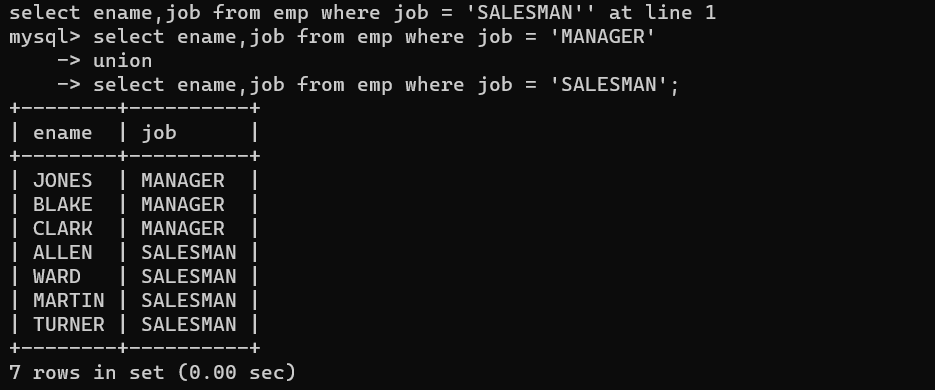

union的效率要高一些。对于表连接来说，每连接一次新表，则匹配的次数满足笛卡尔积，成倍的翻。但是union可以减少匹配的次数。在减少匹配次数的情况下，还可以完成两个结果集的拼接。

a 连接 b 连接 c
	a 10条记录
	b 10条记录
	c 10条记录
	匹配次数是：1000

a 连接 b一个结果：10 * 10 --> 100次
a 连接 c一个结果：10 * 10 --> 100次
使用union的话是：100次 + 100次 = 200次。（union把乘法变成了加法运算）

注意：union在进行结果集合并的时候，要求两个结果集的列数相同，列和列的数据类型要一致。


## 11.limit※

- **limit的作用**

将查询结果集的一部分取出来。通常使用在分页查询当中。百度默认：一页显示10条记录。分页的作用是为了提高用户的体验，因为一次全部都查出来，用户体验差。可以一页一页翻页看。


- **limit的使用**

完整用法：limit startIndex, length
		   startIndex是起始下标，length是长度。
		   起始下标从0开始。

缺省用法：limit 5; 这是取前5.

注意：mysql中limit在order by之后执行。

*按照薪资降序，取出排名在前5名的员工*

```mysql
select
	ename,sal
from 
	emp
order by 
	sal desc
limit 0,5
```

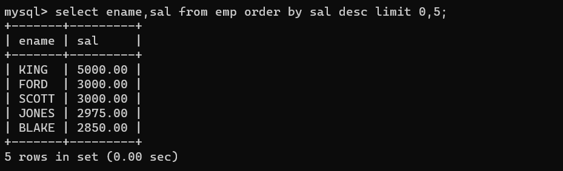


*取出工资排名在5-9名的员工*

```mysql
select ename,sal from emp order by sal desc limit 4,5;
```

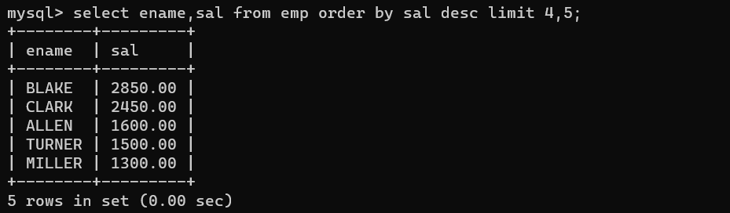


- **分页**

每页显示3条记录
	第1页：limit 0,3		[0    1    2]
	第2页：limit 3,3		[3    4    5]
	第3页：limit 6,3		[6    7    8]
	第4页：limit 9,3		[9   10 11]

每页显示pageSize条记录
	第pageNo页：limit (pageNo - 1) * pageSize  , pageSize

记公式：
	limit (pageNo-1)*pageSize , pageSize


## 12.DQL语句总结

```mysql
select 
	...
from
	...
where
	...
group by
	...
having
	...
order by
	...
limit
	...

/*
	执行顺序？
		1.from
		2.where
		3.group by
		4.having
		5.select
		6.order by
		7.limit..
*/
```


# 3.DML&DDL语句

## 1.表的创建

- **建表的语法格式**

建表属于DDL语句，DDL包括：create drop alter

```mysql
create table 表名(字段名1 数据类型, 字段名2 数据类型, 字段名3 数据类型);

create table 表名(
	字段名1 数据类型, 
	字段名2 数据类型, 
	字段名3 数据类型
);
/*
	表名：建议以t_ 或者 tbl_开始，可读性强。见名知意。
	字段名：见名知意。
	表名和字段名都属于标识符。
*/
```


- **mysql中的数据类型**

**varchar(最长255)**

可变长度的字符串；比较智能，节省空间；会根据实际的数据长度动态分配空间。

优点：节省空间

缺点：需要动态分配空间，速度慢。

**char(最长255)**

定长字符串，不管实际的数据长度是多少，分配固定长度的空间去存储数据。使用不恰当的时候，可能会导致空间的浪费。

优点：不需要动态分配空间，速度快。

缺点：使用不当可能会导致空间的浪费。

varchar和char我们应该怎么选择？

性别字段你选什么？因为性别是固定长度的字符串，所以选择char。

姓名字段你选什么？每一个人的名字长度不同，所以选择varchar。

**int(最长11)**

数字中的整数型。等同于java的int。

**bigint**

数字中的长整型。等同于java中的long。

**float**	

单精度浮点型数据

**double**

双精度浮点型数据

**date**

短日期类型

**datetime**

长日期类型

**clob**

字符大对象，最多可以存储4G的字符串。

比如：存储一篇文章，存储一个说明。

超过255个字符的都要采用CLOB字符大对象来存储。

Character Large OBject:CLOB

**blob**

二进制大对象

Binary Large OBject

专门用来存储图片、声音、视频等流媒体数据。往BLOB类型的字段上插入数据的时候，例如插入一个图片、视频等，需要使用IO流才行。


- **创建一个学生表**

学号、姓名、年龄、性别、邮箱地址

```mysql
create table t_student(
	no int,
	name varchar(32),
	sex char(1),
	age int(3),
	email varchar(255)
);
```


- **删除表**

```mysql
drop table t_student; #当这张表不存在时会报错
```

```mysql
drop table if exists t_student; #如果这张表存在的话，删除
```


- **插入数据insert**

```mysql
#语法格式
insert into 表名(字段名1，字段名2，字段名3...) values(值1，值2，值3);

#注意：字段名和值要一一对应：数量要对应，数据类型要对应。
#insert语句执行成功的话，表中一定会多一条记录，没有给其他字段指定值的话，默认值为NULL
#insert语句中的“字段名”可以省略，省略相当于所有字段都在，对应所有值也要写上。
```


- **设置默认值default**

```mysql
create table t_student(
	no int,
	name varchar(32),
	sex char(1) default 'm', #使用default可以设置默认值
	age int(3),
	email varchar(255)
);
```


- **insert插入日期**

格式化数字：format(数字，‘格式’)

```mysql
select ename,format(sal,'$999,999') as sal from emp;
```

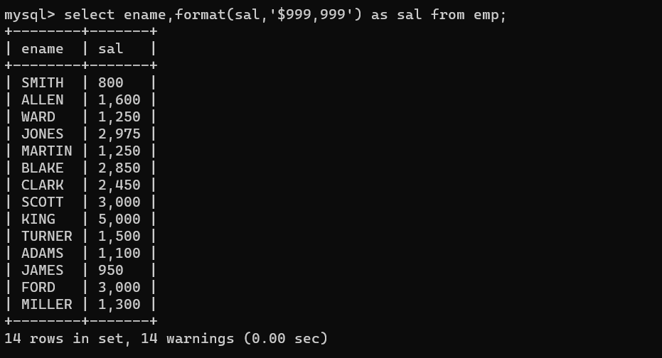


**str_to_date()：将字符串varchar类型转换成date类型**

**date_format：将date类型转换成具有一定格式的varchar字符串类型。**

```mysql
create table t_user(
	id int,
	name varchar(32),
	birth date #生日也可以使用date日期类型
);

create table t_user(
	id int,
    name varchar(32),
    birth char(10) #1990-10-11 生日可以使用字符串，没问题。
);
```


str_to_date函数可以将字符串转换成日期类型date

语法格式：str_to_date('字符串日期', '日期格式')

```mysql
/*
mysql的日期格式：
		%Y	年
		%m 月
		%d 日
		%h	时
		%i	分
		%s	秒
*/
```

```mysql
insert into t_user(id,name,birth) 
values(1,'zhangsan',str_to_date('01-10-1990','%d-%m-%Y'))

/*
	str_to_date函数可以把字符串varchar转换成日期date类型数据，
	通常使用在插入insert方面，因为插入的时候需要一个日期类型的数据，
	需要通过该函数将字符串转换成date。
	
	如果你提供的日期字符串是这个格式(%Y-%m-%d)，str_to_date函数就不需要了！！！
	insert into t_user(id,name,birth) values(2, 'lisi', '1990-10-01');
*/
```


date_format()函数可以将日期类型转换成特定格式的字符串。

date_format函数：date_format(日期类型数据, '日期格式')

这个函数通常使用在查询日期方面。设置展示的日期格式。

```mysql
select id,name,date_format(birth,'%m/%d/%Y') as birth from t_user;
```

```mysql
select id,name,birth from t_user;
/*
	以上的SQL语句实际上是进行了默认的日期格式化，
	自动将数据库中的date类型转换成varchar类型。
	并且采用的格式是mysql默认的日期格式：'%Y-%m-%d'
*/
```


- **date和datetime两个类型的区别**

date是短日期：只包括年月日信息。

datetime是长日期：包括年月日时分秒信息。

```mysql
drop table if exists t_user;
create table t_user(
	id int,
	name varchar(32),
	birth date,
	create_time datetime #长日期类型
);
```

mysql短日期默认格式：%Y-%m-%d

mysql长日期默认格式：%Y-%m-%d %h:%i:%s

```mysql
insert into 
t_user(id,name,birth,create_time) 
values(1,'zhangsan','1990-10-01','2020-03-18 15:49:50');
```


**使用now()可以获取系统当前时间**

```mysql
insert into t_user(id,name,birth,create_time) values(2,'lisi','1991-10-01',now());
```


- **修改update**

```mysql
#语法格式
update	
	表名
set 
	字段名1=值1，字段名2=值2，字段名3=值3...
where
	条件;
	
#注意：没有条件限制会导致所有数据全部更新
```


- **删除数据delete**

```mysql
#语法格式
delete from 表名 where 条件；

#注意：没有条件，整张表的数据会删除
```


- **insert语句一次插入多条记录**

```mysql
insert into t_user(id,name,birth,create_time) values
    (1,'zhangsan','1998-06-01',now()),
    (2,'lisi','2000-05-03',now()),
    (3,'xiaoming','2005-10-16',now());
```


- **快速创建表（了解）**

```mysql
create table emp2 as select * from emp;
```

原理：将一个查询结果当做一张表新建，可以快速完成表的复制，同时也能将表中的数据复制过来。


- **将查询结果插入到一张表中（了解）**

```mysql
insert into emp2 select * from emp;
```


- **快速删除表中的数据**

```mysql
delete from emp2;#这种方式删除数据比较慢
```

delete语句删除数据的原理：

表中的数据被删除了，但是数据在硬盘上的真实存储空间不会被释放。

缺点：删除效率比较低

优点：支持回滚，可以恢复数据


```mysql
truncate table 表名;#属于DDL操作
```

truncate语句删除数据的原理：

删除效率高，表被一次截断，物理删除

缺点：不支持回滚

优点：快速


- **删除表**

以上两种操作都是删除表中的数据，删除表可以使用如下语句

```mysql
drop table 表名;
```


## 2.对表结构的增删改

- 什么是对表结构的修改？

添加一个字段，删除一个字段，修改一个字段。

对表结构的修改需要使用：alter，属于DDL语句。

DDL包括：create drop alter


实际开发中，需求确定之后，表设计完成后，很少对表结构进行修改。因为开发过程中，修改表结构，成本比较高。修改表结构，对应的操作数据表的代码就要进行大量的修改。

修改表结构的操作少，且不需要掌握，如果真的需要修改表结构，可以使用工具。


# 4.约束※

## 1.概念

- **什么是约束？**

约束对应的英语单词：constraint

在创建表的时候，我们可以给表中的字段加上一些约束，来保证这个表中数据的完整性、有效性。

约束的作用就是为了保证：表中的数据有效。


- **约束包括哪些？**

  非空约束：not null

  唯一性约束: unique

  主键约束: primary key （简称PK）

  外键约束：foreign key（简称FK）

  检查约束：check（mysql不支持，oracle支持）


## 2.非空约束

非空约束not null约束的字段不能为NULL。

```mysql
drop table if exists t_vip;
create table t_vip(
	id int,
    name varchar(255) not null #not null只有列级约束，没有表级约束
);

insert into t_vip(id,name) values(1,'zhangsan');
insert into t_vip(id,name) values(2,'lisi');
```

补充：以.sql结尾的文件被称为sql脚本文件，sql脚本文件中编写了大量的sql语句。执行sql脚本文件的时候，该文件中所有的sql语句会全部执行。

如何在MySQL中执行sql脚本？

```mysql
source 文件路径
```


## 3.唯一性约束

- **唯一性约束unique约束的字段不能重复，但是可以为NULL**

```mysql
drop table if exists t_vip;
create table t_vip(
	id int,
	name varchar(255) unique,#唯一性约束
	email varchar(255)
);

insert into t_vip(id,name,email) values(1,'zhangsan1','zhangsan@123.com');
insert into t_vip(id,name,email) values(2,'lisi','lisi@123.com');
insert into t_vip(id,name,email) values(3,'wangwu','wangwu1@123.com');

#name字段有唯一性约束，不能插入重复的数据，会报错
insert into t_vip(id,name,email) values(4,'wangwu','wangwu@sina.com');

#具有唯一性约束的字段可以为NULL
insert into t_vip(id) values(4);
insert into t_vip(id) valuse(5);


```


- **使name和email两个字段联合起来具有唯一性**

```mysql
drop table if exists t_vip;
create table t_vip(
	id int,
    name varchar(255),
    email varchar(255),
    unique(name,email) #约束没有添加在列的后面，这种约束被称为表级约束
);

#name和email字段联合起来唯一
insert into t_vip(id,name,email) values(1,'zhangsan','zhangsan@123.com');
insert into t_vip(id,name,email) valuse(2,'zhangsan','zhangsan@sina.com');

#需要使多个字段联合起来具有唯一性时，使用表级约束
```


- **unique和not null可以联合使用**

```mysql
drop table if exists t_vip;
create table t_vip(
	id int,
    name varchar(255) not null unique
);

/*
	在mysql中，如果一个字段同时被not null和unique约束，该字段自动变为主键字段
	（oracle不一样）
*/
```


## 4.主键约束※

- **相关术语**

主键约束：就是一种约束。

主键字段：该字段上添加了主键约束，这样的字段叫做：主键字段

主键值：主键字段中的每一个值都叫做：主键值。


- **什么是主键？**

主键值是每一行记录的唯一标识。

主键值是每一行记录的身份证号

任何一张表都应该有主键，没有主键，表无效。

主键的特征：not null + unique（主键值不能是NULL，同时也不能重复！）


- 如何给一张表添加主键约束

```mysql
drop table if exists t_vip;
create table t_vip(
	id int primary key,#列级约束
    name varchar(255)
);
```

```mysql
drop table if exists t_vip;
create table t_vip(
	id int,
    name varchar(255), 
    primary key(id) #表级约束
);
```


- **表级约束主要是给多个字段联合起来添加约束**

```mysql
drop table if exists t_vip;
create table t_vip(
	id int,
    name varchar(255),
    primary key(id,name)
);
```

在实际开发中，不建议使用复合主键，建议使用单一主键，因为主键存在的意义就是这行记录的唯一性，只要意义达到即可，单一主键可以达到效果。


主键值建议使用：int、bigint、char等类型

不建议使用varchar做主键，主键值一般都是数字，都是定长的。


主键还可以分为：

自然主键：主键值是一个自然数，和业务没关系

业务主键：主键值和业务紧密关联，例如用银行卡账号做主键值，这就是业务主键

在实际开发中，自然主键使用的更多。因为主键只要做到不重复就行，不需要有意义。业务主键不好，因为主键一旦和业务挂钩，当业务发生变动时，可能会影响主键值，所以不建议使用业务主键。


- **在mysql中，有一种机制，可以帮助自动维护一个主键**

```mysql
drop table if exists t_vip;
create table t_vip(
	id int primary key auto_increment, #auto_increment表示自增，从1开始，以1递增
	name varchar(255)
);
```


## 5.外键约束※

- **相关术语**

外键约束：一种约束（foreign key）

外键字段：该字段上添加了外键约束

外键值：外键字段当中的每一个值。

```mysql
/*
业务背景：请设计数据库表，来描述“班级和学生”的信息

第一种方案：班级和学生存储在一张表中
no(pk)			name	 			classno				classname
-------------------------------------------------------------------
1				jack				100					高三一班			
2				lucy				100					高三一班
3				tom					100					高三一班
4				lilei				101					高三二班
5				lusi				101					高三二班
6				xiaoming			101					高三二班

分析以上方案的缺点：数据冗余，空间浪费。
*/

/*
第二种方案：班级一张表，学生一张表
t_class 班级表
classno(pk)				classname
-----------------------------------
100						高三一班
101						高三二班

t_student 学生表
no(pk)			name	 			classno				
---------------------------------------------
1				jack				100							
2				lucy				100					
3				tom					100					
4				lilei				101					
5				lusi				101					
6				xiaoming			101				

	当cno字段没有任何约束的时候，可能会导致数据无效。可能出现一个102，但是102班级不存在。
	所以为了保证cno字段中的值都是100和101，需要给cno字段添加外键约束。
	那么：cno字段就是外键字段。cno字段中的每一个值都是外键值。

*/

#先创建父表
create table t_class(
	classno int primary key,
    classname(255)
);

#再创建字表
create table t_student(
	no int primary key,
    name varchar(255),
    classno int,
    foreign key(classno) references t_class(classno)
);

#先向父表插入数据
    insert into t_class(classno,classname) values(100,'高三一班');
    insert into t_class(classno,classname) values(101,'高三二班');

#再向子表添加数据
insert into t_student(no,name,classno) values
(1,'jack',100),
(2,'lucy',100),
(3,'tom',100),
(4,'lilei',101),
(5,'lusi',101),
(6,'xiaoming',101);

```

**子表中的外键引用的父表中的某个字段，被引用的这个字段不用必须是主键，但必须具有unique约束。**

**外键值可以为NULL**


# 5.存储引擎

- **什么是存储引擎，有什么作用？**

存储引擎是MySQL中特有的一个术语，其他数据库没有。（Oracle中有，但不叫这个名字）。存储引擎是一个表存储/组织数据的方式。不同的存储引擎，表存储数据的方式不同。


- **给表设置指定的存储引擎**

```mysql
show create table 表名;
```

使用该命令可以查看表的存储引擎

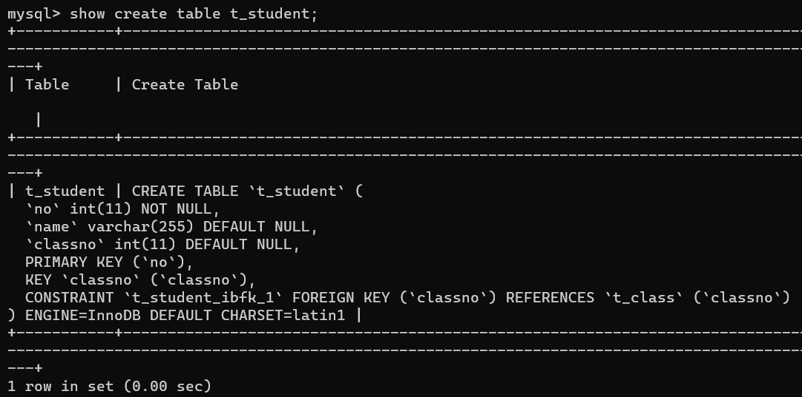


可以在建表的时候给表指定存储引擎，以及编码方式

```mysql
create table t_product(
	id int primary key,
	name varchar(255)
)engine=InnoDB default charset=gbk;
```


- **如何查看mysql支持哪些存储引擎？**

```mysql
#查看当前数据库版本
select version();
/*
+------------+
| version()  |
+------------+
| 5.7.31-log |
+------------+
1 row in set (0.00 sec)

*/

#查看mysql所有的存储引擎
show engines \G
/*
*************************** 1. row ***************************
      Engine: InnoDB
     Support: DEFAULT
     Comment: Supports transactions, row-level locking, and foreign keys
Transactions: YES
          XA: YES
  Savepoints: YES
*************************** 2. row ***************************
      Engine: MRG_MYISAM
     Support: YES
     Comment: Collection of identical MyISAM tables
Transactions: NO
          XA: NO
  Savepoints: NO
*************************** 3. row ***************************
      Engine: MEMORY
     Support: YES
     Comment: Hash based, stored in memory, useful for temporary tables
Transactions: NO
          XA: NO
  Savepoints: NO
*************************** 4. row ***************************
      Engine: BLACKHOLE
     Support: YES
     Comment: /dev/null storage engine (anything you write to it disappears)
Transactions: NO
          XA: NO
  Savepoints: NO
*************************** 5. row ***************************
      Engine: MyISAM
     Support: YES
     Comment: MyISAM storage engine
Transactions: NO
          XA: NO
  Savepoints: NO
*************************** 6. row ***************************
      Engine: CSV
     Support: YES
     Comment: CSV storage engine
Transactions: NO
          XA: NO
  Savepoints: NO
*************************** 7. row ***************************
      Engine: ARCHIVE
     Support: YES
     Comment: Archive storage engine
Transactions: NO
          XA: NO
  Savepoints: NO
*************************** 8. row ***************************
      Engine: PERFORMANCE_SCHEMA
     Support: YES
     Comment: Performance Schema
Transactions: NO
          XA: NO
  Savepoints: NO
*************************** 9. row ***************************
      Engine: FEDERATED
     Support: NO
     Comment: Federated MySQL storage engine
Transactions: NULL
          XA: NULL
  Savepoints: NULL
9 rows in set (0.00 sec)

	MySQL支持9大存储引擎，当前5.7.31版本支持8个。版本不同，支持的情况不同。

*/
```


以下介绍几个MySQL常用的存储引擎

- **MyISAM存储引擎**

使用三个文件表示每个表：

​	格式文件 — 存储表结构的定义（mytable.frm）

​	数据文件 — 存储表行的内容（mytable.MYD）

​	索引文件 — 存储表上索引（mytable.MYI）：索引是一本书的目录，缩小扫描范围，提高查询效率的一种机制。

可被转换为压缩、只读表来节省空间

补充：

对于一张表来说，只要是主键，或者加有unique约束的字段上会自动创建索引。

MyISAM存储引擎特点：可被转换为压缩、只读表来节省空间。这是MyISAM存储引擎的优势

MyISAM不支持事务机制，安全性低。


- **InnoDB存储引擎**

InnoDB是mysql默认的存储引擎，同时也是一个重量级的存储引擎。

InnoDB支持事务，支持数据库崩溃后自动恢复机制。

InnoDB存储引擎最主要的特点是：非常安全。

它管理的表具有下列主要特征：

​	– 每个 InnoDB 表在数据库目录中以.frm 格式文件表示

​	– InnoDB 表空间 tablespace 被用于存储表的内容（表空间是一个逻辑名称。表空间存储数据+索引。）

​	– 提供一组用来记录事务性活动的日志文件

​	– 用 COMMIT(提交)、SAVEPOINT 及ROLLBACK(回滚)支持事务处理

​	– 提供全 ACID 兼容

​	– 在 MySQL 服务器崩溃后提供自动恢复

​	– 多版本（MVCC）和行级锁定

​	– 支持外键及引用的完整性，包括级联删除和更新

InnoDB最大的特点就是支持事务：以保证数据的安全。效率不是很高，并且也不能压缩，不能转换为只读，不能很好的节省存储空间。


- **MEMORY存储引擎**

使用 MEMORY 存储引擎的表，其数据存储在内存中，且行的长度固定，

这两个特点使得 MEMORY 存储引擎非常快。

MEMORY 存储引擎管理的表具有下列特征：

​	– 在数据库目录内，每个表均以.frm 格式的文件表示。

​	– 表数据及索引被存储在内存中。（目的就是快，查询快！）

​	– 表级锁机制。

​	– 不能包含 TEXT 或 BLOB 字段。

MEMORY 存储引擎以前被称为HEAP 引擎。

MEMORY引擎优点：查询效率是最高的。不需要和硬盘交互。

MEMORY引擎缺点：不安全，关机之后数据消失。因为数据和索引都是在内存当中。


# 6.事务※

- **什么是事务？**

一个事务其实就是一个完整的业务逻辑。是一个最小的工作单元。不可再分。

什么是一个完整的业务逻辑？

​	假设转账，从A账户向B账户中转账10000.

​	将A账户的钱减去10000（update语句）

​	将B账户的钱加上10000（update语句）

​	这就是一个完整的业务逻辑。

​	以上的操作是一个最小的工作单元，要么同时成功，要么同时失败，不可再分。这两个update语句要求必须同时成功或者同时失败，这样才能保证钱是正确的。


- **只有DML语句与事务有关**

insert、delete、update这三个语句和事务有关系，因为这三个语句是对数据库表中数据进行增删改的，只要涉及到对数据的增、删、改，一定要考虑安全问题。


- **假设所有的业务，只要一条DML语句就能完成，还有必要存在事务机制吗？**

正是因为做某件事的时候，需要多条DML语句共同联合起来才能完成，所以需要事务的存在。如果任何一件复杂的事儿都能一条DML语句搞定，那么事务则没有存在的价值了。

到底什么是事务呢？说到底，说到本质上，一个事务其实就是多条DML语句同时成功，或者同时失败！

事务：就是批量的DML语句同时成功，或者同时失败！


- **事务是怎么做到多条DML语句同时成功和同时失败的呢？**

InnoDB存储引擎：提供一组用来记录事务性活动的日志文件

​	事务开启了：
​	insert
​	insert
​	insert
​	delete
​	update
​	update
​	update
​	事务结束了！

在事务的执行过程中，每一条DML的操作都会记录到“事务性活动的日志文件”中。

在事务的执行过程中，我们可以提交事务，也可以回滚事务。

**提交事务**

清空事务性活动的日志文件，将数据全部彻底持久化到数据库表中。提交事务标志着，事务的结束。并且是一种全部成功的结束。

**回滚事务**

将之前所有的DML操作全部撤销，并且清空事务性活动的日志文件。回滚事务标志着，事务的结束。并且是一种全部失败的结束。


- **如何提交事务，如何回滚事务？**

  提交事务：commit;

  回滚事务：roolback;	（回滚只能回滚到上一次的提交点）

事务对应的英语单词是：transaction

mysql默认支持自动提交事务，就是每执行一条DML语句，就提交一次。这种自动提交不符合开发习惯，因为一个业务通常是需要多条DML语句共同执行才能完成的，为了保证数据的安全，必须要求同时成功之后再提交。

**执行：start transaction; 命令可以关闭MySQL的自动提交机制**

```mysql
/*------------------------------------回滚事务-------------------------------------------*/
select * from t_student;
/*
+----+----------+---------+
| no | name     | classno |
+----+----------+---------+
|  1 | jack     |     100 |
|  2 | lucy     |     100 |
|  3 | tom      |     100 |
|  4 | lilei    |     101 |
|  5 | lusi     |     101 |
|  6 | xiaoming |     101 |
+----+----------+---------+
表中此时有6条记录
*/

#启动一个事务
start transaction; 

#向表中插入一条数据
insert into t_student(no,name,classno) values(7,'Jim',100);

#查询
select * from t_student;
/*
+----+----------+---------+
| no | name     | classno |
+----+----------+---------+
|  1 | jack     |     100 |
|  2 | lucy     |     100 |
|  3 | tom      |     100 |
|  4 | lilei    |     101 |
|  5 | lusi     |     101 |
|  6 | xiaoming |     101 |
|  7 | Jim      |     100 |
+----+----------+---------+
插入数据成功
*/

#回滚事务
rollback;

#查询
select * from t_student;
/*
+----+----------+---------+
| no | name     | classno |
+----+----------+---------+
|  1 | jack     |     100 |
|  2 | lucy     |     100 |
|  3 | tom      |     100 |
|  4 | lilei    |     101 |
|  5 | lusi     |     101 |
|  6 | xiaoming |     101 |
+----+----------+---------+
刚才插入的数据被撤销了
*/

```


```mysql
/*------------------------------------提交事务-------------------------------------------*/
select * from t_student;
/*
+----+----------+---------+
| no | name     | classno |
+----+----------+---------+
|  1 | jack     |     100 |
|  2 | lucy     |     100 |
|  3 | tom      |     100 |
|  4 | lilei    |     101 |
|  5 | lusi     |     101 |
|  6 | xiaoming |     101 |
+----+----------+---------+
表中此时有6条记录
*/

#启动一个事务
start transaction; 

#向表中插入一条数据
insert into t_student(no,name,classno) values(7,'Jim',100);

#查询
select * from t_student;
/*
+----+----------+---------+
| no | name     | classno |
+----+----------+---------+
|  1 | jack     |     100 |
|  2 | lucy     |     100 |
|  3 | tom      |     100 |
|  4 | lilei    |     101 |
|  5 | lusi     |     101 |
|  6 | xiaoming |     101 |
|  7 | Jim      |     100 |
+----+----------+---------+
插入数据成功
*/

#提交事务
commit;

#查询
select * from t_student;
/*
+----+----------+---------+
| no | name     | classno |
+----+----------+---------+
|  1 | jack     |     100 |
|  2 | lucy     |     100 |
|  3 | tom      |     100 |
|  4 | lilei    |     101 |
|  5 | lusi     |     101 |
|  6 | xiaoming |     101 |
|  7 | Jim      |     100 |
+----+----------+---------+
*/

#回滚事务
rollback;

#查询
select * from t_student;
/*
+----+----------+---------+
| no | name     | classno |
+----+----------+---------+
|  1 | jack     |     100 |
|  2 | lucy     |     100 |
|  3 | tom      |     100 |
|  4 | lilei    |     101 |
|  5 | lusi     |     101 |
|  6 | xiaoming |     101 |
|  7 | Jim      |     100 |
+----+----------+---------+
因为之前插入的数据已经提交，回滚操作只能回滚到上次提交的地方。
*/
```


- **事务包括四个特性**

**原子性**：说明事务是最小的工作单元。不可再分。

**一致性**：所有事务要求，在同一个事务当中，所有操作必须同时成功，或者同时失败，以保证数据的一致性。

**隔离性**：A事务和B事务之间具有一定的隔离。教室A和教室B之间有一道墙，这道墙就是隔离性。A事务在操作一张表的时候，另一个事务B也操作这张表会怎样？

**持久性**：事务最终结束的一个保障。事务提交，就相当于将没有保存到硬盘上的数据保存到硬盘上。


- **事务的隔离性**

A教室和B教室中间有一道墙，这道墙可以很厚，也可以很薄。这就是事务的隔离级别。这道墙越厚，表示隔离级别就越高。

事务和事务之间有四个隔离级别：

**读未提交：**

read uncommitted（最低的隔离级别）《没有提交就读到了》

什么是读未提交？事务A可以读取到事务B未提交的数据。

这种隔离级别存在的问题就是：脏读现象！(Dirty Read)我们称读到了脏数据。这种隔离级别一般都是理论上的，大多数的数据库隔离级别都是二档起步！

**读已提交：**

read committed《提交之后才能读到》

什么是读已提交？事务A只能读取到事务B提交之后的数据。

这种隔离级别解决了什么问题？解决了脏读的现象。

这种隔离级别存在什么问题？不可重复读取数据。

什么是不可重复读取数据呢？在事务开启之后，第一次读到的数据是3条，当前事务还没有结束，可能第二次再读取的时候，读到的数据是4条，3不等于4，称为不可重复读取。

这种隔离级别是比较真实的数据，每一次读到的数据是绝对的真实。oracle数据库默认的隔离级别是：read committed

**可重复读：**

repeatable read《提交之后也读不到，永远读取的都是刚开启事务时的数据》

什么是可重复读取？事务A开启之后，不管是多久，每一次在事务A中读取到的数据都是一致的。即使事务B将数据已经修改，并且提交了，事务A读取到的数据还是没有发生改变，这就是可重复读。

可重复读解决了什么问题？解决了不可重复读取数据。

可重复读存在的问题是什么？可以会出现幻影读。每一次读取到的数据都是幻象。不够真实。早晨9点开始开启了事务，只要事务不结束，到晚上9点，读到的数据还是那样。读到的是假象。不够绝对的真实。

**mysql中默认的事务隔离级别就是可重复读**

**序列化/串行化：**

serializable（最高的隔离级别）

这是最高隔离级别，效率最低。解决了所有的问题。这种隔离级别表示事务排队，不能并发。每一次读取到的数据都是最真实的，并且效率是最低的。


- **验证各种隔离级别**

```mysql
#查看隔离级别
select @@tx_isolation;
/*
+-----------------+
| @@tx_isolation  |
+-----------------+
| REPEATABLE-READ |
+-----------------+
mysql默认的隔离级别
*/

#被测试的表
create table t_user(
	id int primary key,
    name varchar(255)
);
```

```mysql
#验证read uncommited
#设置隔离级别为读未提交
set global transaction level read uncommitted;
#设置完成之后重新启动mysql

#事务A
start transaction;
select * from t_user;
#Empty set (0.00 sec)

#事务B
start transaction;
insert into t_user values(1,'zhangsan');

#事务A
select * from t_user;
/*
+----+----------+
| id | name     |
+----+----------+
|  1 | zhangsan |
+----+----------+
1 row in set (0.00 sec)
事务B刚插入，还未提交的数据被查出来了
*/
```

```mysql
#验证read committed
set global transaction  isolation level read committed;
#设置完成之后重新启动mysql

#事务A
start transaction;
select * from t_user;
#Empty set (0.00 sec)

#事务B
start transaction;
insert into t_user(id,name) values(1,'zhangsan');

#事务A
select * from t_user;
#Empty set (0.00 sec)

#事务B
commit;

#事务A
select * from t_user;
/*
+----+----------+
| id | name     |
+----+----------+
|  1 | zhangsan |
+----+----------+
1 row in set (0.00 sec)
事务B提交之后，事务A才能查到插入的信息
*/
```

```mysql
#验证repeatable read
set global transaction isolation level repeatable read;
#设置完成之后重新启动mysql

#事务A
start transaction;
select * from t_user;
#Empty set (0.00 sec)

#事务B
insert into t_user(id,name) values(1,'zhangsan');
commit;

#事务A
select * from t_user;
#Empty set (0.00 sec)
#事务B提交之后，事务A还是不能读到插入的记录，事务A读到的一直是事务刚开始的记录
```

```mysql
#验证serializable
set global transaction isolation level serializable;
#设置完成之后重新启动mysql

#事务A
start transaction;
select * from t_user;
#Empty set (0.00 sec)

#事务B
start transaction;
insert into t_user(id,name) values(1,'zhangsan');
#执行该插入语句时事务B会陷入等待状态，直到事务A提交之后再继续执行
```


# 7.索引

- **什么是索引？**

索引是在数据库表的字段上添加的，是为了提高查询效率存在的一种机制。一张表的一个字段可以添加一个索引，当然，多个字段联合起来也可以添加索引。索引相当于一本书的目录，是为了缩小扫描范围而存在的一种机制。

对于一本字典来说，查找某个汉字有两种方式：

第一种方式：一页一页挨着找，直到找到为止，这种查找方式属于全字典扫描。效率比较低。

第二种方式：先通过目录（索引）去定位一个大概的位置，然后直接定位到这个位置，做局域性扫描，缩小扫描的范围，快速的查找。这种查找方式属于通过索引检索，效率较高。

```mysql
select * from t_user where name = 'jack';
/*
	以上的这条SQL语句会去name字段上扫描，为什么？因为查询条件是：name='jack'
	
	如果name字段上没有添加索引（目录），或者说没有给name字段创建索引，
	MySQL会进行全扫描，会将name字段上的每一个值都比对一遍。效率比较低。

	MySQL在查询方面主要就是两种方式：
		第一种方式：全表扫描
		第二种方式：根据索引检索。
	
*/

```

**注意：**
在实际中，汉语字典前面的目录是排序的，按照a b c d e f....排序，为什么排序呢？因为只有排序了才会有区间查找这一说.（缩小扫描范围其实就是扫描某个区间罢了！）

在mysql数据库当中索引也是需要排序的，并且这个所以的排序和TreeSet数据结构相同。TreeSet（TreeMap）底层是一个自平衡的二叉树！在mysql当中索引是一个B-Tree数据结构。遵循左小又大原则存放。采用中序遍历方式遍历取数据。


- **索引的实现原理**

```mysql
/*
假设有一张用户表：t_user

	id(PK)					name					每一行记录在硬盘上都有物理存储编号
	----------------------------------------------------------------------------------
	100						zhangsan				0x1111
	120						lisi					0x2222
	99						wangwu					0x8888
	88						zhaoliu					0x9999
	101						jack					0x6666
	55						lucy					0x5555
	130						tom						0x7777
*/
```

在任何数据库当中主键上都会自动添加索引对象，id字段上自动有索引，因为id是PK。另外在mysql当中，一个字段上如果有unique约束的话，也会自动创建索引对象。

在任何数据库当中，任何一张表的任何一条记录在硬盘存储上都有一个硬盘的物理存储编号。

在mysql当中，索引是一个单独的对象，不同的存储引擎以不同的形式存在，在MyISAM存储引擎中，索引存储在一个.MYI文件中。在InnoDB存储引擎中索引存储在一个逻辑名称叫做tablespace的当中。在MEMORY存储引擎当中索引被存储在内存当中。不管索引存储在哪里，索引在mysql当中都是一个树的形式存在。（自平衡二叉树：B-Tree）


- **什么条件下考虑添加索引？**

条件1：数据量庞大（到底有多么庞大算庞大，这个需要测试，因为每一个硬件环境不同）

条件2：该字段经常出现在where的后面，以条件的形式存在，也就是说这个字段总是被扫描。

条件3：该字段很少的DML(insert delete update)操作。（因为DML之后，索引需要重新排序。）

建议不要随意添加索引，因为索引也是需要维护的，太多的话反而会降低系统的性能。

建议通过主键查询，建议通过unique约束的字段进行查询，效率是比较高的


- **索引的创建和删除**

```mysql
#创建索引
create index 索引名 on 表名(字段名);
```

```mysql
#删除索引
drop index 索引名 on 表名;
```


- 在mysql中查看一条SQL语句是否使用了索引进行检索

```mysql
explain SQL语句
explain select * from emp where ename = 'KING';
/*
+----+-------------+-------+------------+------+---------------+------+---------+------+------+----------+-------------+
| id | select_type | table | partitions | type | possible_keys | key  | key_len | ref  | rows | filtered | Extra       |
+----+-------------+-------+------------+------+---------------+------+---------+------+------+----------+-------------+
|  1 | SIMPLE      | emp   | NULL       | ALL  | NULL          | NULL | NULL    | NULL |   14 |    10.00 | Using where |
+----+-------------+-------+------------+------+---------------+------+---------+------+------+----------+-------------+
1 row in set, 1 warning (0.00 sec)
rows = 14 说明扫描了14条记录，没有使用索引。type=ALL
*/

#在ename字段上添加索引
create index emp_ename_index on emp(ename);

explain select * from emp where ename = 'KING';
/*
+----+-------------+-------+------------+------+-----------------+-----------------+---------+-------+------+----------+-------+
| id | select_type | table | partitions | type | possible_keys   | key             | key_len | ref   | rows | filtered | Extra |
+----+-------------+-------+------------+------+-----------------+-----------------+---------+-------+------+----------+-------+
|  1 | SIMPLE      | emp   | NULL       | ref  | emp_ename_index | emp_ename_index | 13      | const |    1 |   100.00 | NULL  |
+----+-------------+-------+------------+------+-----------------+-----------------+---------+-------+------+----------+-------+
1 row in set, 1 warning (0.00 sec)
rows = 1 说明扫描了一条记录，没有扫描所有的记录，使用了索引。type=ref
*/
```


- **索引失效的情况举例**

```mysql
#失效的第一种情况
select * from emp where ename like '%T';
/*
ename上即使添加了索引，也不会走索引，为什么？
			原因是因为模糊匹配当中以“%”开头了！
			尽量避免模糊查询的时候以“%”开始。
			这是一种优化的手段/策略。
*/

```

```mysql
#失效的第二种情况
select * from emp where ename = 'KING' or job = 'MANAGER';
/*
	使用or的时候会失效，如果使用or那么要求or两边的条件字段都要有索引，才会走索引，
	如果其中一边有一个字段没有索引，那么另一个字段上的索引也会实现。所以这就是为什么不建议使用or的原因。

*/
```

```mysql
#失效的第三种情况
create index emp_job_sal_index on emp(job,sal);
select * from emp where job = 'MANAGER';#使用了索引
select * from emp where sal = 800;#没有使用索引
/*
	使用复合索引的时候，没有使用左侧的列查找，索引失效
	什么是复合索引？两个字段，或者更多的字段联合起来添加一个索引，叫做复合索引。
*/


```

```mysql
#失效的第四种情况
select * from emp where sal+1 = 800;
#在where当中索引列参加了运算，索引失效。
```

```mysql
#失效的第五种情况
select * from emp where lower(ename) = 'smith';
#在where中使用了函数

```

..........


- **补充**

索引是各种数据库进行优化的重要手段。优化的时候优先考虑的因素就是索引。

索引在数据库当中分了很多类

​	单一索引：一个字段上添加索引。

​	复合索引：两个字段或者更多的字段上添加索引。

​	主键索引：主键上添加索引。

​	唯一性索引：具有unique约束的字段上添加索引。
.....

注意：唯一性比较弱的字段上添加索引用处不大。


# 8.视图

- **什么是视图？**

view：站在不同的角度去看待同一份数据。


- **视图的创建和删除**

```mysql
#创建视图对象
create view 视图名 as DQL语句；
create view dept2_view as select * from dept2;
```

```mysql
#删除视图对象
drop view 视图名;
drop view dept2_view;
```


- **视图的作用**

可以面向视图对象进行增删改查，对视图对象的增删改查，会导致原表被操作。

```mysql
#对视图的操作
#面向视图查询
select * from dept2_view;

#面向视图插入
insert into dept2_view (deptno,dname,loc) values(60,'SALES','BEIJING');

#查询原表数据
select * from dept2;

#面向视图删除
delete from dept2_view;

#查询原表数据
select * from dept2;


#创建视图对象
create view
	emp_dept_view
as
	select
		e.ename,e.sal,d.danme
	from 
		emp e
	join
		dept d
	on e.deptno = d.deptno;
	
#查询视图对象
select * from emp_dept_view;

#面向视图更新
update emp_dept_view set sal = 1000 where dname = 'ACCOUNTING';

#原表数据被更新
select * from emp;
```

**视图在开发中的作用：方便，简化开发，利于维护**

假设有一条非常复杂的SQL语句，而这条SQL语句需要在不同的位置上反复使用。每一次使用这个sql语句的时候都需要重新编写，很长，很麻烦，怎么办？可以把这条复杂的SQL语句以视图对象的形式新建。在需要编写这条SQL语句的位置直接使用视图对象，可以大大简化开发。并且利于后期的维护，因为修改的时候也只需要修改一个位置就行，只需要修改视图对象所映射的SQL语句。

我们以后面向视图开发的时候，使用视图的时候可以像使用table一样。可以对视图进行增删改查等操作。视图不是在内存当中，视图对象也是存储在硬盘上的，不会消失。

视图对应的语句只能是DQL语句。但是视图对象创建完成之后，可以对视图进行增删改查等操作。

增删改查，又叫做：CRUD。CRUD是在公司中程序员之间沟通的术语。一般我们很少说增删改查。一般都说CRUD。

​		C:Create（增）
​		R:Retrive（查：检索）
​		U:Update（改）
​		D:Delete（删）


# 9.DBA常用命令

- 数据导出

```mysql
#在windows的dos命令窗口中
#导出数据库
mysqldump 数据库名>路径\数据库名.sql -uroot -p123456
#导出指定的表
mysqldump 数据库名 表名>路径\表名.sql -uroot -p123465
```


- **数据导入**

```mysql
#先登录到mysql数据库服务器上
#创建数据库
create database 数据库名；
#使用数据库
use 数据库名
#初始化数据库
source 文件路径
```


# 10.数据库设计三范式

- **什么是数据设计范式？**

数据库表的设计依据。教你怎么进行数据库表的设计。

**第一范式：要求任何一张表必须有主键，每一个字段原子性不可再分。**

**第二范式：建立在第一范式的基础之上，要求所有非主键字段完全依赖主键，不要产生部分依赖。**

**第三范式：建立在第二范式的基础之上，要求所有非主键字段直接依赖主键，不要产生传递依赖。**

声明：三范式是面试官经常问的，所以一定要熟记在心！

设计数据库表的时候，按照以上的范式进行，可以避免表中数据的冗余，空间的浪费。


- **第一范式**

最核心，最重要的范式，所有表的设计都需要满足。必须有主键，并且每一个字段都是原子性不可再分。

```mysql
/*
	学生编号	学生姓名 	联系方式
	------------------------------------------
	1001		张三		zs@gmail.com,1359999999
	1002		李四		ls@gmail.com,13699999999
	1001		王五		ww@163.net,13488888888

	以上是学生表，满足第一范式吗？
	不满足，第一：没有主键。第二：联系方式可以分为邮箱地址和电话
	
	学生编号(pk) 	学生姓名	邮箱地址		 联系电话
	----------------------------------------------------
	1001			张三		zs@gmail.com	1359999999
	1002			李四		ls@gmail.com	13699999999
	1003			王五		ww@163.net		13488888888
*/
```


- **第二范式**

建立在第一范式的基础之上，要求所有非主键字段必须完全依赖主键，不要产生部分依赖。

```mysql
/*
	学生编号 	学生姓名 	教师编号 	教师姓名
	----------------------------------------------------
	1001		张三		001			王老师
	1002		李四		002			赵老师
	1003		王五		001			王老师
	1001		张三		002			赵老师
	
	这张表描述了学生和老师的关系：（1个学生可能有多个老师，1个老师有多个学生）
	这是非常典型的：多对多关系！

	分析以上的表是否满足第一范式？
		不满足第一范式。
	
	怎么满足第一范式呢？修改

	学生编号+教师编号(pk)		学生姓名  	教师姓名
	----------------------------------------------------
	1001			001			张三		王老师
	1002			002			李四		赵老师
	1003			001			王五		王老师
	1001			002			张三		赵老师

	学生编号 教师编号，两个字段联合做主键，复合主键（PK: 学生编号+教师编号）
	经过修改之后，以上的表满足了第一范式。但是满足第二范式吗？
		不满足，“张三”依赖1001，“王老师”依赖001，显然产生了部分依赖。
		产生部分依赖有什么缺点？
			数据冗余了。空间浪费了。“张三”重复了，“王老师”重复了。
	
	为了让以上的表满足第二范式，你需要这样设计：
		使用三张表来表示多对多的关系！！！！
		学生表
		学生编号(pk)		学生名字
		------------------------------------
		1001				张三
		1002				李四
		1003				王五
		
		教师表
		教师编号(pk)		教师姓名
		--------------------------------------
		001					王老师
		002					赵老师

		学生教师关系表
		id(pk)			学生编号(fk)			教师编号(fk)
		------------------------------------------------------
		1					1001					001
		2					1002					002
		3					1003					001
		4					1001					002
	

	背口诀：
		多对多怎么设计？
			多对多，三张表，关系表两个外键！！！！！！！！！！！！！！！
*/
```


- **第三范式**

第三范式建立在第二范式的基础之上。要求所有非主键字典必须直接依赖主键，不要产生传递依赖。

```mysql
/*
	学生编号（PK） 学生姓名 	班级编号  	班级名称
	---------------------------------------------------------
	1001			张三		01		一年一班
	1002			李四		02		一年二班
	1003			王五		03		一年三班
	1004			赵六		03		一年三班
	
	以上表的设计是描述：班级和学生的关系。很显然是1对多关系！
	一个教室中有多个学生。

	分析以上表是否满足第一范式？
		满足第一范式，有主键。
	
	分析以上表是否满足第二范式？
		满足第二范式，因为主键不是复合主键，没有产生部分依赖。主键是单一主键。
	
	分析以上表是否满足第三范式？
		第三范式要求：不要产生传递依赖！
		一年一班依赖01，01依赖1001，产生了传递依赖。
		不符合第三范式的要求。产生了数据的冗余。
	
	那么应该怎么设计一对多呢？

		班级表：一
		班级编号(pk)				班级名称
		----------------------------------------
		01							一年一班
		02							一年二班
		03							一年三班

		学生表：多
		学生编号（PK） 学生姓名 		班级编号(fk)
		-------------------------------------------
		1001			张三			01			
		1002			李四			02			
		1003			王五			03			
		1004			赵六			03		
		
		背口诀：
			一对多，两张表，多的表加外键！！！！！！！！！！！！
*/
```


- **总结表的设计**

```mysql
/*

一对多：
	一对多，两张表，多的表加外键！！！！！！！！！！！！

多对多：
	多对多，三张表，关系表两个外键！！！！！！！！！！！！！！！

一对一：
	一对一放到一张表中不就行了吗？为啥还要拆分表？
	在实际的开发中，可能存在一张表字段太多，太庞大。这个时候要拆分表。
	一对一怎么设计？
		没有拆分表之前：一张表
		t_user
		id	login_name	login_pwd	real_name	email			address........
		---------------------------------------------------------------------------
		1	zhangsan	123			张三			zhangsan@xxx
		2	lisi		123			李四			lisi@xxx
		...
			
	这种庞大的表建议拆分为两张：
		t_login 登录信息表
		id(pk)		login_name		login_pwd	
		-------------------------------------
		1			zhangsan		123			
		2			lisi			123			

		t_user 用户详细信息表
		id(pk)	real_name	email			address........	login_id(fk+unique)
		-----------------------------------------------------------------------------------------
		100		张三			zhangsan@xxx							1
		200		李四			lisi@xxx								2


		口诀：一对一，外键唯一！！！！！！！！！！
*/
```


- **补充**

数据库设计三范式是理论上的。

实践和理论有的时候有偏差。

最终的目的都是为了满足客户的需求，有的时候会拿冗余换执行速度。

因为在sql当中，表和表之间连接次数越多，效率越低。（笛卡尔积）

有的时候可能会存在冗余，但是为了减少表的连接次数，这样做也是合理的，并且对于开发人员来说，sql语句的编写难度也会降低。

